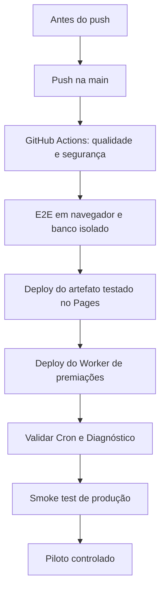

# Processo oficial de release

Versão piloto formal atual: **v1.0.0**, aprovada em **16/07/2026** para 5–10 usuários.

Este é o procedimento único para promover uma versão do **Conte os Feitos**. A aprovação legal atual cobre somente o piloto controlado de 5–10 usuários.

## Antes do push

- confirmar que a alteração pertence ao escopo aprovado;
- revisar `git diff` e garantir que não há segredo, backup ou arquivo de ambiente;
- executar lint, build e testes proporcionais à mudança;
- confirmar que migrations novas, quando existirem, possuem procedimento manual próprio;
- não reativar o deploy Git nativo do Cloudflare Pages.

## Publicação

1. Faça push para `main`.
2. Aguarde a Action **Quality and security**.
3. Confirme, nesta ordem, os jobs verdes:
   - `quality`;
   - `browser-smoke`;
   - `Deploy verified Pages build`;
   - `Deploy journey awards Worker`.
4. Não contorne uma Action vermelha usando “Retry deployment” no Cloudflare.
5. O pipeline normal não aplica migrations.

## Validação após o deploy

1. Abra o aplicativo em janela privada e confirme login.
2. Confirme que `/api/auth/me` desconectado responde `401`, não `404`.
3. Teste uma Jornada: iniciar, responder, recarregar, retomar e concluir.
4. Confirme Ranking provisório enquanto a Jornada estiver aberta.
5. Teste logout e novo login sem depender de F5.
6. Abra **Painel → Diagnóstico** e confirme estado saudável e fila de medalhas zerada.
7. Em **Cloudflare → Workers & Pages → quiz-biblico-journey-awards**:
   - confirme o Cron `* * * * *`;
   - confirme `journey_awards_completed` sem `journey_awards_failed`.
8. Teste o fallback offline e a recuperação depois de reconectar.

## Critério de aprovação do piloto

- CI, E2E, Pages e Worker verdes;
- diagnóstico saudável;
- nenhuma migration pendente;
- fila de medalhas zerada ou progredindo dentro da estimativa;
- smoke test aprovado em computador e celular;
- checklist legal aprovado para piloto controlado;
- autorização de responsáveis por menores mantida externamente pela organização responsável.

Uma abertura pública exige nova aprovação legal, operacional e de escopo.
