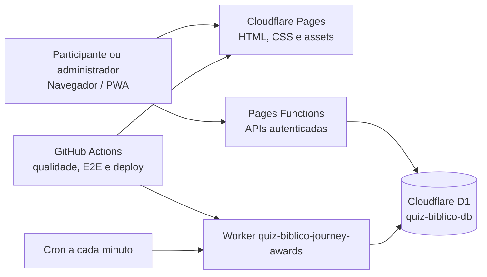

# Arquitetura do Conte os Feitos

## Visão geral

## Responsabilidades

- **Pages:** entrega a interface estática e o PWA.
- **Pages Functions:** autenticação, autorização, Jornadas, tentativas, respostas, Ranking, administração e diagnósticos.
- **D1:** fonte de verdade para contas, sessões, conteúdo, competição, auditoria e checkpoints.
- **Worker de premiações:** encerra Jornadas vencidas, sincroniza Medalhas e registra processamento idempotente.
- **GitHub Actions:** bloqueia deploy antes de lint, build, testes, audit e E2E; publica primeiro Pages e depois Worker.
- **Service Worker:** mantém somente assets públicos e fallback offline; nunca armazena APIs ou HTML privado.

## Limites de segurança

- O navegador nunca é fonte de verdade para tempo, resposta correta ou pontuação.
- Autorização e organização são obtidas pela sessão no servidor.
- Pages e Worker usam o mesmo binding `DB`, mas são publicados separadamente.
- O pipeline normal não aplica migrations.
- Sugestões com IA permanecem desativadas no piloto v1.0.

## Fluxo de deploy

Consulte [RELEASE.md](../RELEASE.md). Para incidentes do Worker, consulte [OPERATIONS_JOURNEY_AWARDS.md](OPERATIONS_JOURNEY_AWARDS.md).

