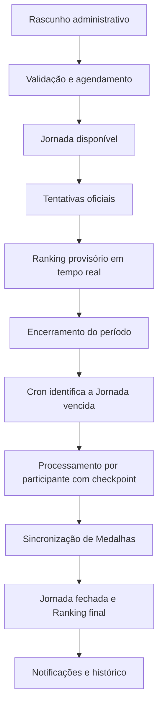

# Ciclo de uma Jornada

## Fluxo oficial

## Enquanto a Jornada está aberta

- o melhor resultado oficial de cada participante compõe o Ranking provisório;
- a posição pode mudar até o encerramento;
- Medalhas competitivas de colocação não são definitivas;
- tentativas de treino não consomem tentativas oficiais e não entram no Ranking.

## No encerramento

1. O Cron executa a cada minuto e procura Jornadas vencidas ainda não processadas.
2. Cada invocação processa até sete participantes, respeitando o orçamento gratuito do D1.
3. O checkpoint `(round_id, user_id, job_type)` impede repetição de efeitos.
4. Depois que todos os participantes elegíveis forem processados, a Jornada recebe o marcador final e muda para `closed`.
5. O Ranking passa a ser final e as Medalhas sincronizadas ficam disponíveis.

Para 200 participantes, a estimativa nominal é de aproximadamente 29 minutos. O Diagnóstico exibe a fila e a estimativa real.

## Jornada de Treino

- permanece vinculada a uma Jornada, mas usa modo `practice`;
- não consome tentativa oficial;
- não altera melhor pontuação, Ranking ou temporada;
- não concede Medalhas competitivas;
- pode ser retomada de forma idempotente conforme as regras de sessão.

## Cancelamento e retomada operacional

Jornadas canceladas são reconciliadas sem exclusão do histórico. Em falha do Worker, checkpoints concluídos são preservados e o próximo Cron retoma somente o trabalho pendente.

