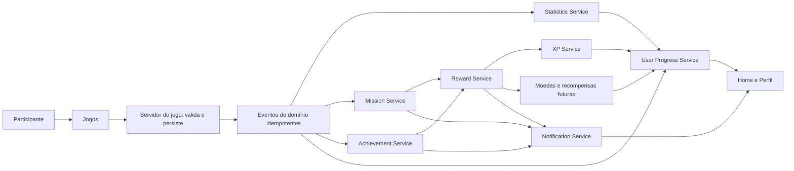

# Core Platform Architecture

Status: **Aprovado e alinhado à implementação em 21/07/2026**

Este documento define a arquitetura dos sistemas compartilhados da plataforma **Conte os Feitos** antes de qualquer implementação. O servidor permanece como fonte da verdade para XP, progressão, moedas, recompensas, missões, conquistas e demais desbloqueáveis persistentes.

O Core Platform não substitui as regras internas dos jogos. Cada jogo continua responsável por sua própria partida e envia ao Core apenas resultados validados pelo servidor, por meio de contratos explícitos e idempotentes.

## Princípios arquiteturais

- Jogos não podem conceder XP, moedas ou conquistas diretamente no cliente.
- Eventos competitivos somente são emitidos depois da validação e persistência do resultado pelo servidor do jogo.
- O Core deve aceitar novamente o mesmo evento sem duplicar efeitos.
- Cada operação deve ser isolada por usuário, organização e jogo quando aplicável.
- Falhas em recompensas secundárias não podem corromper o resultado original de uma partida.
- Reprocessamentos devem ser auditáveis e retomar do último ponto seguro.
- `rounds` e `attempts` pertencem ao Quiz Bíblico e não devem ser reutilizados por novos jogos sem decisão formal registrada em ADR.
- Medalhas continuam sendo premiações competitivas das Jornadas do Quiz; Conquistas são objetivos gerais da plataforma.
- Temporadas da plataforma afetarão somente desbloqueáveis e colecionáveis, salvo decisão futura explícita.

## Contrato comum de eventos

Os jogos se comunicam com o Core por eventos de domínio emitidos exclusivamente no servidor. Todo evento deve conter, no mínimo:

- `eventId`: identificador global e imutável para idempotência;
- `eventType`: tipo e versão do evento;
- `occurredAt`: instante confiável definido pelo servidor;
- `userId` e `organizationId` obtidos da sessão ou do registro persistido;
- `source.gameId`: identificador do jogo no catálogo oficial quando a origem for um jogo;
- `source.sourceId`: identificador da partida, tentativa ou ação persistida de origem;
- `payload`: somente os dados necessários ao processamento;
- `version`: versão inteira positiva do contrato.

O Core registra o processamento do `eventId`. Um evento repetido deve retornar o resultado persistido anteriormente, sem duplicar XP, moedas, progresso, conquistas ou notificações.

## 1. XP Service

### Responsabilidades

- aplicar concessões e ajustes de XP validados;
- rejeitar valores arbitrários enviados pelo navegador;
- garantir idempotência por evento de origem;
- manter um livro-razão de alterações de XP;
- disponibilizar saldo e histórico resumido;
- informar o User Progress Service após uma alteração confirmada.

### Entradas

- evento de jogo validado, como `GAME_FINISHED` versão `1`;
- regra de XP identificada e versionada;
- usuário, organização, jogo e origem confiáveis;
- ajuste administrativo autorizado, com motivo e auditoria.

### Saídas

- quantidade de XP concedida;
- saldo total atualizado;
- registro imutável no livro-razão;
- evento `XP_GRANTED` ou futuro evento de ajuste, sempre com versão separada;
- indicação de possível mudança de nível.

O XP Service não define sozinho a pontuação interna de um jogo. Pontuação competitiva e XP da plataforma são conceitos separados.

## 2. Reward Service

### Responsabilidades

- orquestrar recompensas derivadas de eventos válidos;
- conceder XP por meio do XP Service;
- conceder moedas por meio de um livro-razão próprio;
- preparar suporte futuro para itens, baús, colecionáveis e desbloqueáveis;
- impedir concessões duplicadas;
- registrar regra, origem e versão de cada recompensa.

### Entradas

- evento de domínio já validado;
- definição versionada de recompensa;
- contexto do usuário, organização, jogo, missão ou conquista;
- chave idempotente da concessão.

### Saídas

- resumo das recompensas concedidas;
- saldos atualizados de XP e moedas;
- registros individuais no livro-razão correspondente;
- evento `REWARD_GRANTED` e, futuramente, evento explícito de colecionável;
- solicitação de notificação quando houver algo relevante ao usuário.

Recompensas futuras devem ser adicionadas como tipos explícitos. Não devem ser armazenadas em um campo genérico sem validação de esquema.

## 3. Achievement Service

Conquistas representam objetivos gerais da plataforma e não substituem as medalhas competitivas do Quiz.

### Desbloqueio

- avalia critérios versionados após eventos elegíveis;
- confirma requisitos usando dados persistidos e serviços oficiais;
- registra cada conquista uma única vez por usuário e escopo;
- pode solicitar recompensas associadas ao Reward Service;
- prepara `ACHIEVEMENT_UNLOCKED` somente após persistência; a publicação ocorrerá pelo consumidor oficial.

### Consulta

- lista conquistas disponíveis, desbloqueadas e pendentes;
- retorna progresso quando o critério permitir exposição;
- filtra por usuário, organização, temporada ou jogo conforme a definição;
- não expõe critérios secretos que prejudiquem desafios futuros.

### Persistência

- catálogo versionado de definições de conquistas;
- registro de desbloqueio com usuário, data, evento de origem e versão;
- progresso derivado de estatísticas ou armazenado em checkpoints idempotentes;
- histórico preservado quando uma definição for substituída.

## 4. Mission Service

### Missão diária

- seleciona ou instancia uma missão por janela diária e fuso oficial;
- acompanha progresso a partir de eventos válidos;
- impede repetição da recompensa na mesma janela;
- encerra ou expira a missão de forma determinística;
- delega a concessão ao Reward Service.

### Missão semanal prevista

- utiliza o mesmo contrato da missão diária com período e critérios diferentes;
- pode envolver um ou mais jogos, desde que cada evento declare `gameId`;
- não deve interferir em Jornadas, rankings ou medalhas do Quiz;
- só será habilitada após decisão de produto e definição das regras.

### Progresso

- recebe eventos de jogo e plataforma;
- atualiza somente missões ativas e compatíveis;
- usa `eventId` para impedir incrementos duplicados;
- retorna valor atual, meta, estado, período e elegibilidade da recompensa;
- registra conclusão antes de solicitar a recompensa.

## 5. Statistics Service

### Estatísticas globais

- jogos iniciados e concluídos;
- dias ativos e sequência de atividade;
- tempo agregado de participação, quando confiável e necessário;
- distribuição por jogo sem misturar regras competitivas específicas.

### Estatísticas por jogo

- métricas comuns: partidas válidas, conclusões, melhor desempenho normalizado e última atividade;
- métricas específicas em namespaces próprios, como dados de Jornada para o Quiz;
- filtros consistentes para treino, partidas inválidas, abandonadas ou incompletas;
- agregações atualizadas por eventos idempotentes ou recalculadas a partir da fonte oficial.

O Statistics Service não deve se tornar uma segunda fonte de verdade para resultados, XP ou Conquistas. Seus dados são projeções reconstruíveis a partir dos eventos oficiais; XP, nível e Conquistas permanecem nos serviços responsáveis.

## 6. Notification Service

### Notificações internas

- cria e consulta notificações da caixa interna do participante;
- mantém estado de lida/não lida;
- respeita organização, usuário e preferências futuras;
- evita duplicatas por evento e tipo de notificação;
- não envia conteúdo sensível em título ou prévia.

### Eventos da plataforma

Pode consumir, entre outros:

- `REWARD_GRANTED`;
- `ACHIEVEMENT_UNLOCKED`;
- `MISSION_COMPLETED`;
- `LEVEL_UP`;
- anúncio de novo jogo publicado;
- eventos operacionais autorizados já existentes.

O serviço não concede recompensas nem altera progresso. Ele apenas comunica fatos já persistidos por seus serviços responsáveis.

## 7. User Progress Service

### Nível

- calcula o nível usando uma curva versionada de progressão;
- deriva o nível do XP confirmado;
- registra mudanças relevantes sem permitir edição pelo cliente.

### XP

- consulta o saldo oficial do XP Service;
- apresenta XP atual, faixa do nível e XP necessário para o próximo nível;
- não duplica o livro-razão de XP.

### Sequência

- acompanha dias elegíveis de atividade com fuso e regra versionados;
- processa no máximo um avanço por janela diária;
- define claramente regras de perda, manutenção e recuperação futura;
- não reutiliza sequências competitivas internas dos jogos.

### Progresso

- fornece uma visão consolidada de nível, XP, sequência, moedas e conquistas;
- compõe dados dos serviços responsáveis sem assumir sua propriedade;
- oferece um contrato estável para Home, Perfil e futuras telas de recompensas;
- retorna estados vazios seguros para recursos ainda não habilitados.

## 8. Relação entre os serviços

1. O servidor de um jogo valida e persiste a ação ou conclusão.
2. O jogo publica um evento idempotente para o Core Platform.
3. Statistics Service atualiza suas projeções.
4. Mission Service aplica progresso às missões elegíveis.
5. Achievement Service avalia conquistas gerais.
6. Mission e Achievement solicitam recompensas ao Reward Service.
7. Reward Service coordena XP Service, moedas e recompensas futuras.
8. User Progress Service consolida os saldos e calcula nível e sequência.
9. Notification Service comunica fatos já confirmados.

Nenhum serviço deve chamar outro em um ciclo. A ordem de processamento deve ser explícita, e efeitos secundários precisam de checkpoints para retomada segura.

## Limites de domínio

| Domínio | Fonte da verdade | Observação |
| --- | --- | --- |
| Resultado de partida | Servidor e banco do jogo | Nunca calculado pelo Core a partir do cliente. |
| Ranking e medalhas de Jornada | Quiz Bíblico | Permanecem fora do Achievement Service. |
| XP da plataforma | XP Service | Livro-razão idempotente. |
| Moedas | Reward Service | Livro-razão separado do XP. |
| Missões | Mission Service | Progresso baseado em eventos válidos. |
| Conquistas gerais | Achievement Service | Não substituem medalhas. |
| Estatísticas | Statistics Service | Projeções reconstruíveis. |
| Notificações | Notification Service | Comunica fatos, não os cria. |
| Visão consolidada do usuário | User Progress Service | Composição dos serviços oficiais. |

## Estratégia de implementação futura

Antes de implementar qualquer serviço, devem ser aprovados:

1. contratos e versões dos eventos;
2. modelo de persistência e índices;
3. limites transacionais no D1;
4. política de idempotência e reprocessamento;
5. regras de XP, nível, sequência e moedas;
6. separação entre dados globais e dados por organização;
7. testes de concorrência, autorização e recuperação;
8. migration segura e estratégia de rollback.

Mudanças relevantes nesta arquitetura devem ser registradas em ADR antes da implementação.
