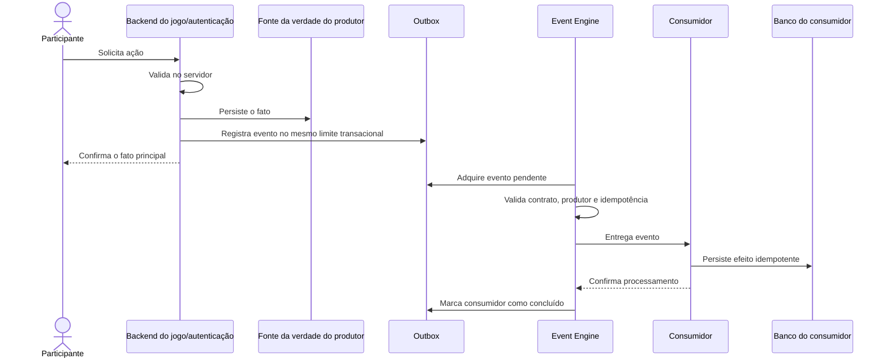
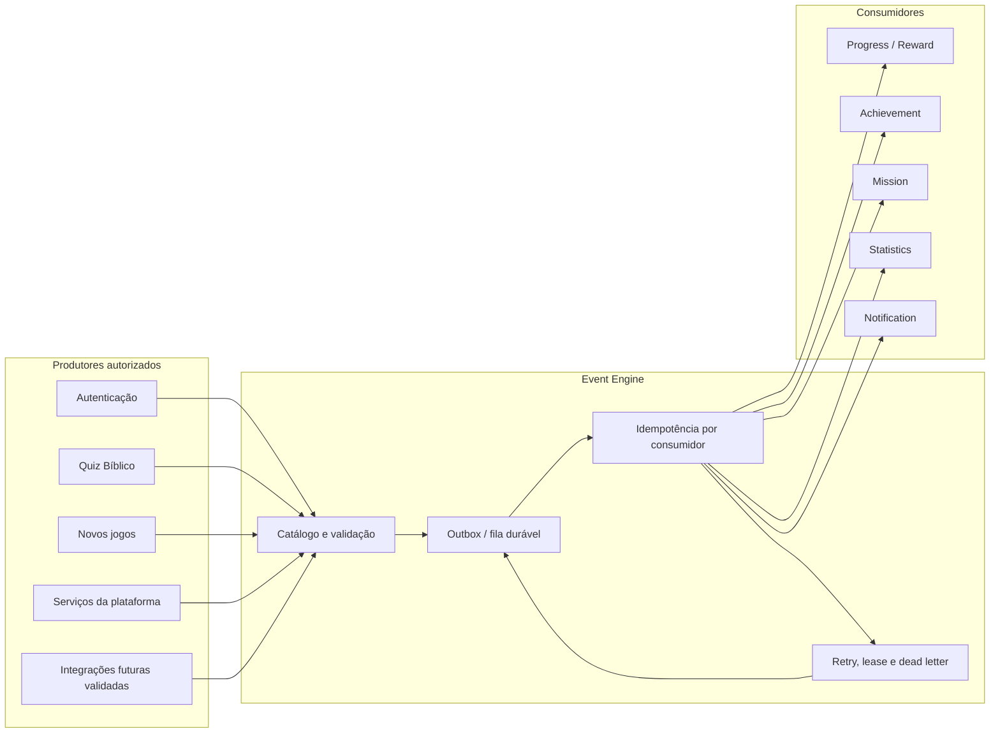
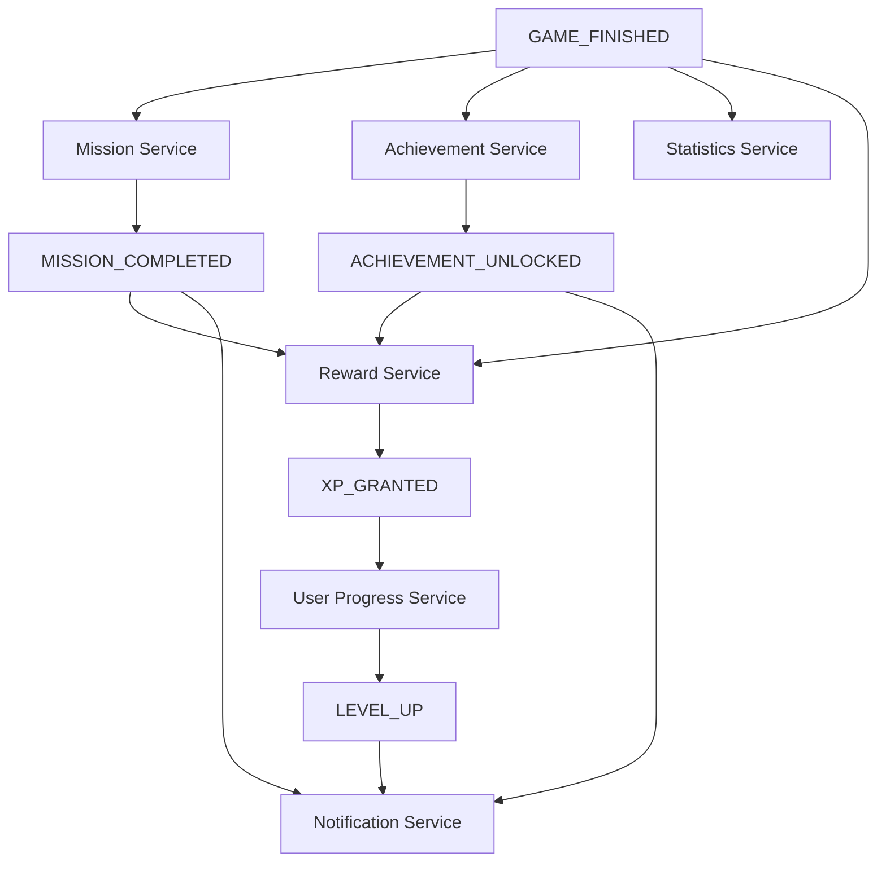

# Core Platform Event Engine

Status: **Aprovado e alinhado à implementação em 21/07/2026**

Este documento define o futuro **Event Engine** do Core Platform do **Conte os Feitos**. Ele especifica contratos, responsabilidades, produtores, consumidores, idempotência e recuperação antes de qualquer implementação.

> Nota de referência: `PLATFORM_MASTER_PLAN.md` não existe no repositório. Para esta proposta, `docs/PRODUCT/ROADMAP.md` foi utilizado como plano mestre oficial equivalente, conforme a decisão já registrada em `CORE_PLATFORM_PROGRESS_IMPLEMENTATION.md`.

## Princípios

- O servidor é a única autoridade para emitir eventos que gerem efeitos persistentes.
- O navegador pode solicitar uma ação, mas nunca declarar que ganhou XP, concluiu missão ou desbloqueou conquista.
- O evento descreve um fato já validado e persistido pelo domínio produtor.
- Reprocessar o mesmo evento não pode duplicar efeitos.
- Cada consumidor mantém sua própria confirmação de processamento.
- Eventos não substituem a fonte da verdade de cada domínio.
- Quiz, Jornadas, tentativas, Ranking e Medalhas continuam pertencendo ao Quiz Bíblico.
- Eventos devem respeitar isolamento por usuário e organização e conter somente os dados necessários.
- Integrações de novos jogos exigem contratos versionados e testes, não alterações ad hoc nos serviços centrais.

## 1. Objetivo do Event Engine

### Papel dentro da plataforma

O Event Engine será a camada interna que transporta fatos confiáveis entre jogos, autenticação e serviços do Core Platform. Ele desacopla produtores de consumidores: um jogo informa que uma partida terminou, enquanto Progress, Mission, Achievement, Statistics e Notification decidem independentemente se esse fato lhes interessa.

O motor deverá:

- validar o envelope e a versão de cada evento;
- reconhecer somente tipos cadastrados;
- registrar recebimento e processamento idempotentes;
- encaminhar o evento aos consumidores inscritos;
- respeitar dependências explícitas entre consumidores;
- registrar falhas e permitir retomada segura;
- oferecer rastreabilidade por evento, causa e correlação;
- impedir que payloads do cliente sejam tratados como fatos confiáveis.

### Problemas que resolve

- evita integrações diretas e circulares entre jogos e serviços;
- impede duplicação de XP, moedas, missões, conquistas e notificações;
- padroniza eventos emitidos por jogos atuais e futuros;
- permite reprocessar efeitos secundários sem refazer a partida original;
- preserva o resultado de um jogo mesmo quando um consumidor secundário falha;
- facilita auditoria, diagnóstico e evolução independente dos módulos;
- permite adicionar novos consumidores sem modificar produtores existentes.

### Limites de responsabilidade

O Event Engine **não**:

- valida respostas, pontuação ou conclusão de uma partida;
- calcula XP, nível, moedas, recompensas, conquistas ou missões;
- altera Ranking ou Medalhas das Jornadas;
- aceita concessões arbitrárias vindas do navegador;
- substitui os ledgers de XP e moedas;
- substitui a persistência oficial do jogo;
- define regras de produto dentro do payload;
- garante uma ordem global entre todos os eventos;
- é uma API pública para publicação de eventos.

## 2. Catálogo oficial de eventos

### Convenção de nomes

O catálogo usa nomes estáveis em `UPPER_SNAKE_CASE`. A versão do esquema fica no campo obrigatório `version`, não no nome. Novos significados exigem novo tipo; mudanças compatíveis no envelope ou payload exigem nova versão.

Todos os contratos internos usam a mesma nomenclatura canônica. Conquistas preparam `ACHIEVEMENT_UNLOCKED` versão `1`; não existe contrato paralelo em minúsculas.

### Eventos da plataforma

| Evento | Fato representado | Produtor autorizado | Consumidores previstos |
| --- | --- | --- | --- |
| `USER_REGISTERED` | Conta criada com sucesso | Autenticação | Statistics, Achievement, Notification |
| `USER_LOGGED_IN` | Sessão autenticada iniciada | Autenticação | Statistics |
| `DAILY_LOGIN` | Primeiro login elegível do usuário na janela diária da organização | Autenticação/Core | Mission, Achievement, Statistics |
| `XP_GRANTED` | Concessão de XP confirmada no ledger | XP Service | User Progress, Statistics, Notification |
| `LEVEL_UP` | Nível derivado aumentou após XP confirmado | User Progress Service | Achievement, Notification |
| `ACHIEVEMENT_UNLOCKED` | Conquista geral persistida | Achievement Service | Reward, Statistics, Notification |
| `MISSION_PROGRESS` | Progresso idempotente de missão foi persistido | Mission Service | Statistics, opcionalmente UI projetada |
| `MISSION_COMPLETED` | Missão atingiu a meta e foi persistida como concluída | Mission Service | Reward, Achievement, Statistics, Notification |
| `MISSION_REWARD_CLAIMED` | Resgate idempotente foi confirmado | Mission/Reward Service | Statistics, Notification |
| `REWARD_GRANTED` | Recompensa explícita foi persistida | Reward Service | User Progress, Statistics, Notification |

`USER_LOGGED_IN` pode ocorrer várias vezes por dia. `DAILY_LOGIN` é um fato derivado no servidor e ocorre no máximo uma vez por usuário, organização e janela diária.

### Eventos comuns de jogos

| Evento | Fato representado | Escopo |
| --- | --- | --- |
| `GAME_STARTED` | Sessão válida do jogo foi criada | Qualquer jogo publicado |
| `GAME_FINISHED` | Sessão válida chegou ao estado final conforme as regras do jogo | Qualquer jogo publicado |
| `QUESTION_ANSWERED` | Resposta foi persistida e corrigida pelo servidor | Jogos baseados em perguntas |

Esses eventos comuns carregam `source.gameId`. Seu payload deve usar somente métricas normalizadas necessárias ao Core; dados específicos permanecem no domínio do jogo.

### Evento canônico de conclusão do Quiz

`GAME_FINISHED` é o único evento canônico de conclusão, inclusive para o Quiz Bíblico. `QUIZ_FINISHED` foi retirado do catálogo antes da existência de produtores reais. O adaptador do Quiz emite exatamente um `GAME_FINISHED` por tentativa elegível, depois da persistência final e por meio da outbox. O contrato v1 mínimo permanece aceito; o v2 acrescenta modo, acertos, total de perguntas, conclusão, tentativa e versão do jogo sem reinterpretar eventos antigos.

### Eventos futuros

Um tipo novo somente entra no catálogo após documentar:

1. fato e produtor responsável;
2. esquema e versão do payload;
3. classificação entre plataforma, evento comum de jogo ou evento específico;
4. consumidores e dependências;
5. chave idempotente e regras de reprocessamento;
6. dados pessoais envolvidos e retenção;
7. testes contratuais.

## 3. Contrato de eventos

Todo evento deve respeitar o envelope conceitual abaixo:

```ts
type CorePlatformEvent<TPayload> = {
  eventId: string;
  eventType: EventType;
  occurredAt: number;
  organizationId: string;
  userId: string;
  source: {
    kind: "auth" | "game" | "platform" | "integration";
    service: string;
    gameId?: string;
    sourceId: string;
  };
  payload: TPayload;
  version: number;
  correlationId?: string;
  causationId?: string;
};
```

### Campos obrigatórios

| Campo | Regra |
| --- | --- |
| `eventId` | Identificador global, imutável e não reutilizável. É a raiz da idempotência. |
| `eventType` | Valor existente no catálogo oficial. |
| `occurredAt` | Epoch em milissegundos definido pelo servidor produtor após persistir o fato. |
| `organizationId` | Organização obtida de fonte confiável, nunca aceita livremente do cliente. |
| `userId` | Usuário ativo afetado. Eventos organizacionais sem usuário não fazem parte do contrato v1. |
| `source` | Identifica classe, serviço, jogo e registro persistido de origem. |
| `payload` | Objeto validado pela versão do evento, mínimo e sem segredos desnecessários. |
| `version` | Inteiro positivo que seleciona o esquema do payload. |

### Campos de rastreabilidade

- `correlationId`: agrupa eventos e efeitos pertencentes ao mesmo fluxo de negócio;
- `causationId`: aponta para o `eventId` que causou o evento atual;
- eventos raiz não possuem `causationId`;
- eventos derivados devem preservar o `correlationId` da cadeia.

### Validação

- tamanho máximo do envelope e do payload deve ser limitado;
- campos extras não reconhecidos devem ser rejeitados ou removidos conforme o esquema versionado;
- timestamps futuros ou incoerentes devem ser recusados;
- `source.gameId` deve existir no catálogo oficial quando `kind = "game"`;
- o produtor deve estar autorizado para o tipo informado;
- payload não pode conter senha, token, cookie, resposta secreta futura ou dados pessoais desnecessários;
- valores competitivos vindos do cliente não podem ser copiados sem recálculo e persistência no servidor do jogo.

### Exemplo

```json
{
  "eventId": "quiz:attempt:attempt_123:finished",
  "eventType": "GAME_FINISHED",
  "occurredAt": 1784476800000,
  "organizationId": "org_123",
  "userId": "user_123",
  "source": {
    "kind": "game",
    "service": "quiz-service",
    "gameId": "quiz-biblico",
    "sourceId": "attempt_123"
  },
  "payload": {
    "status": "completed",
    "score": 11680
  },
  "version": 1,
  "correlationId": "attempt_123"
}
```

## 4. Produtores de eventos

### Jogos

- somente o backend do jogo pode emitir;
- emite após validar e persistir o fato;
- usa `gameId` do catálogo oficial;
- não calcula recompensas do Core;
- não reaproveita tabelas do Quiz para outros jogos sem ADR.

### Serviços da plataforma

- XP Service emite `XP_GRANTED` depois do ledger;
- User Progress Service emite `LEVEL_UP` depois do cálculo confirmado;
- Achievement Service emite `ACHIEVEMENT_UNLOCKED` depois do desbloqueio persistido;
- Mission Service emite `MISSION_PROGRESS` e `MISSION_COMPLETED` depois da transição persistida;
- Reward Service emite `REWARD_GRANTED` depois de todos os registros sob sua responsabilidade.

Um consumidor que passa a produzir um evento derivado deve concluir seu próprio processamento antes de publicar esse novo fato.

### Autenticação

- emite eventos apenas após cadastro ou login válidos;
- `DAILY_LOGIN` exige deduplicação por janela e fuso da organização;
- falha do Event Engine não deve invalidar uma sessão já autenticada; o evento fica pendente para retomada.

### Futuras integrações

- precisam de identidade de serviço e permissão por tipo de evento;
- não recebem credenciais de produção do usuário;
- usam adaptadores internos e esquemas versionados;
- eventos externos são considerados não confiáveis até validação e normalização pelo backend da plataforma.

## 5. Consumidores

| Categoria de evento | Progress Service | Achievement Service | Mission Service | Statistics Service | Notification Service |
| --- | --- | --- | --- | --- | --- |
| Cadastro e autenticação | — | Pode avaliar primeiros passos | Pode avançar login diário | Registra atividade | Somente fatos relevantes |
| Início de jogo | — | Opcional por critério | Pode avançar missão elegível | Registra início | — |
| Conclusão de jogo | Pode receber regra de XP via Reward | Avalia critérios | Avança missões elegíveis | Registra conclusão | Comunica somente efeitos confirmados |
| Resposta de pergunta | — | Critérios explicitamente aprovados | Progresso compatível | Métricas agregadas | — |
| XP e nível | Consolida saldo/nível | Avalia marcos | — | Registra progressão | Comunica mudança relevante |
| Conquista | Recebe recompensa somente via Reward | Fonte do fato | — | Registra desbloqueio | Comunica desbloqueio |
| Missão | Recebe recompensa somente via Reward | Pode avaliar marco | Fonte do fato | Registra progresso/conclusão | Comunica conclusão/resgate |
| Recompensa | Consolida saldos | — | — | Registra concessão | Comunica concessão |

Regras importantes:

- consumidores consultam suas próprias definições versionadas;
- nenhum consumidor deve editar dados pertencentes a outro domínio;
- Statistics mantém projeções reconstruíveis, não uma segunda fonte de verdade;
- Notification comunica fatos já confirmados e não concede recompensas;
- Medalhas do Quiz não são consumidoras do Achievement Service nem do Mission Service.

## 6. Idempotência

### Identidade do evento

- `eventId` é estável para o mesmo fato, inclusive após timeout ou repetição da requisição;
- o produtor deve derivá-lo de uma origem persistida quando possível;
- um novo UUID a cada tentativa de envio é proibido, pois impediria deduplicação.

### Confirmação por consumidor

Cada consumidor deverá possuir conceitualmente uma chave única:

```text
(eventId, consumerId, handlerVersion)
```

Isso permite que vários consumidores processem o mesmo evento uma vez cada e que uma nova versão de handler seja reprocessada somente por operação explícita.

Estados de processamento previstos:

- `pending`;
- `processing` com lease temporário;
- `completed`;
- `retryable_failed`;
- `dead_letter`.

### Efeitos derivados

- ledgers de XP e moedas continuam usando seus próprios `event_id` únicos;
- progresso de missão continua usando `(assignment_id, event_id)`;
- conquista continua usando a unicidade por usuário, código e escopo;
- notificações futuras devem usar uma chave derivada de `eventId + notificationType + recipientId`;
- o registro de processamento não substitui as constraints de cada domínio.

### Concorrência

Duas execuções simultâneas devem convergir para um único efeito persistido por meio de constraint única, escrita condicional e recuperação do resultado já existente. Confiar apenas em consulta prévia ou flag em memória não é suficiente no D1.

## 7. Ordem de processamento

### Quando a ordem importa

Dentro de uma cadeia derivada, fatos dependentes só podem ser emitidos depois da persistência anterior:

```text
GAME_FINISHED
→ regra de recompensa
→ XP_GRANTED
→ LEVEL_UP
→ ACHIEVEMENT_UNLOCKED, quando o nível for critério
→ Notification, após o fato final
```

Outros exemplos:

- `MISSION_COMPLETED` somente depois do progresso persistido;
- `MISSION_REWARD_CLAIMED` somente depois dos ledgers idempotentes;
- `ACHIEVEMENT_UNLOCKED` somente depois do desbloqueio persistido.

### Quando os consumidores são independentes

Statistics, Mission e Achievement podem avaliar `GAME_FINISHED` independentemente quando não há dependência declarada entre seus resultados. A falha de um não desfaz o resultado do jogo nem bloqueia necessariamente os demais.

### Garantia proposta

- não existe ordem global;
- eventos de um mesmo agregado podem carregar futuramente um `sequence` monotônico opcional;
- dependências são expressas pelo catálogo de consumidores e por `causationId`, não pela ordem acidental de chegada;
- um evento dependente que chegar antes de seu pré-requisito deve aguardar ou falhar de modo recuperável;
- ciclos entre consumidores são proibidos.

## 8. Tratamento de falhas

### Persistência segura do produtor

A implementação deverá preferir um padrão de **outbox transacional**: o fato de negócio e o evento pendente são gravados na mesma operação atômica do domínio produtor. Se isso não for possível em um fluxo específico, deve existir checkpoint durável antes de confirmar sucesso ao chamador.

### Processamento

1. adquirir o evento pendente com lease limitado;
2. validar envelope, versão e autorização do produtor;
3. executar o consumidor com idempotência;
4. persistir o efeito no domínio consumidor;
5. marcar o consumidor como concluído;
6. publicar eventos derivados somente após a persistência;
7. liberar ou renovar o lease de forma determinística.

### Reprocessamento

- falhas transitórias usam até cinco tentativas, com backoff exponencial iniciado em cinco segundos e limitado a cinco minutos;
- lease vencido permite retomada por outra execução;
- reprocessamento reutiliza o mesmo `eventId`;
- a quinta falha move o recibo para `dead_letter`; contratos inválidos são rejeitados antes da persistência;
- reprocessamento manual exige permissão administrativa, motivo e auditoria;
- payload não deve ser editado para “fazer passar”; correção exige evento compensatório ou nova versão formal.

### Consistência e compensação

- falha secundária não reverte partida, login ou outro fato já confirmado;
- operações parcialmente concluídas devem ser retomadas por checkpoints idempotentes;
- eventos compensatórios são explícitos e nunca apagam o histórico original;
- alertas operacionais devem indicar fila, idade do item mais antigo, tentativas e dead letters sem expor payload sensível.

### Retenção

O tempo de retenção do envelope, dos recibos e de dead letters deverá ser definido antes da migration, considerando auditoria, privacidade, custo do D1 e possibilidade de reconstrução. Eventos não são justificativa para duplicar indefinidamente dados completos de jogos.

## 9. Extensibilidade para novos jogos

Um jogo novo integra-se sem alterar os serviços centrais seguindo este fluxo:

1. entrar no `GAME_CATALOG.md` com status apropriado;
2. definir seu domínio e persistência próprios;
3. escolher eventos comuns que pode emitir, como `GAME_STARTED` e `GAME_FINISHED`;
4. propor eventos específicos somente quando eventos comuns forem insuficientes;
5. criar schemas versionados para os payloads;
6. registrar o produtor e os tipos autorizados;
7. mapear métricas normalizadas, sem enviar estruturas internas desnecessárias;
8. configurar inscrições por catálogo/regra, não por alteração no código do jogo;
9. validar idempotência, isolamento, concorrência e reprocessamento;
10. ativar consumidores gradualmente por feature flag ou configuração segura.

### Contrato de integração conceitual

```ts
type GameEventProducer = {
  gameId: string;
  supportedEvents: Array<{ eventType: EventType; version: number }>;
  buildEvent(sourceRecord: unknown): CorePlatformEvent<unknown>;
};
```

Mission e Achievement interpretam critérios em seus catálogos versionados. Assim, adicionar um jogo não deve exigir condicionais como `if (gameId === ...)` nos serviços centrais. Quando uma mecânica realmente exigir comportamento próprio, ela deve ser implementada em um adaptador do jogo ou em um novo consumidor formal.

## 10. Diagramas

### Fluxo completo



### Produtores, motor e consumidores



### Dependências permitidas



## Decisões do MVP aprovado

1. a execução inicial é síncrona e usa D1, sem Queue ou infraestrutura distribuída;
2. o ledger persistente e os recibos por consumidor possuem lease, falha recuperável e dead letter estrutural;
3. payload e envelope possuem limites explícitos; retry operacional usa backoff e dead letter; retenção continua pendente antes de grande volume;
4. o catálogo aceita somente versões explicitamente registradas e rejeita campos desconhecidos; `GAME_FINISHED` preserva v1 e usa v2 para novos eventos do Quiz;
5. cada tipo autoriza classe e serviço produtor específicos;
6. o diagnóstico administrativo informa falhas e leases vencidos sem expor payload;
7. o MVP não integra o Quiz, autenticação ou outro produtor;
8. a rotina interna de retry é operacional e idempotente; reprocessamento administrativo manual e compensação permanecem fora do MVP;
9. a implementação privilegia poucas escritas indexadas e não cria polling ou processamento em segundo plano.

Os detalhes executáveis e limites estão registrados em
CORE_PLATFORM_EVENT_ENGINE_IMPLEMENTATION.md. A existência do motor
não autoriza emissão automática por jogos nem altera regras dos serviços atuais.
