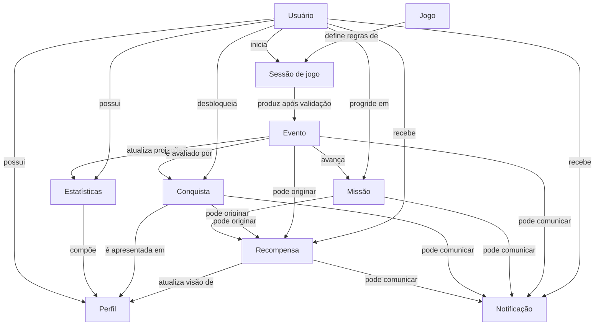

# Domain Model

Status: **Proposta para aprovação**

Este documento define o modelo de domínio oficial da plataforma **Conte os Feitos**. Ele descreve conceitos e regras do negócio, sem definir tabelas, colunas, tipos de banco ou detalhes de implementação.

Este modelo deve orientar o futuro `DATA_MODEL.md`. Decisões de persistência somente poderão ser tomadas depois da aprovação dos limites e relacionamentos descritos aqui.

## Princípios do domínio

- O servidor é a fonte da verdade para resultados, progressão, recompensas e desbloqueios persistentes.
- Cada jogo possui regras próprias e não deve depender da estrutura interna de outro jogo.
- A plataforma recebe somente resultados de jogo já validados.
- Medalhas competitivas das Jornadas pertencem ao Quiz Bíblico; Conquistas pertencem à plataforma.
- Pontuação de um jogo, XP da plataforma e moedas são conceitos diferentes.
- Uma ação repetida não pode produzir efeitos persistentes duplicados.
- Dados e ações devem respeitar o usuário, a organização e as permissões aplicáveis.

## 1. Usuário

### Objetivo

Representar a identidade autenticável de uma pessoa que acessa a plataforma.

### Responsabilidades

- identificar de forma única a pessoa no sistema;
- autenticar e manter sessões de acesso seguras;
- possuir situação de acesso, função e permissões;
- ser a referência de propriedade para progresso, sessões e preferências;
- registrar os aceites legais exigidos.

### Relacionamentos

- possui um Perfil;
- inicia Sessões de jogo;
- recebe Recompensas, Conquistas e Notificações;
- possui progresso em Missões;
- é representado em Estatísticas pessoais;
- pratica Jogos disponíveis à sua organização.

### Regras de negócio

- somente um usuário ativo e autorizado pode iniciar ações autenticadas;
- identidade, organização e permissões são obtidas da sessão segura, nunca do cliente;
- suspensão impede novas ações protegidas sem apagar o histórico;
- alteração de credenciais deve seguir as políticas de sessão e auditoria;
- exclusão ou anonimização não pode corromper o histórico legítimo da plataforma.

### Limites de responsabilidade

- não armazena dados públicos de apresentação, que pertencem ao Perfil;
- não calcula pontuação, XP, nível ou conquistas;
- não representa uma partida nem um dispositivo.

## 2. Perfil

### Objetivo

Representar a apresentação e as preferências visíveis de um Usuário.

### Responsabilidades

- manter nome de exibição, apelido e informações opcionais aprovadas;
- controlar a forma como o usuário aparece em rankings e áreas sociais;
- disponibilizar preferências de privacidade e comunicação;
- apresentar uma visão consolidada do progresso sem ser sua fonte da verdade.

### Relacionamentos

- pertence a exatamente um Usuário;
- apresenta dados derivados de Estatísticas, Conquistas e Recompensas;
- pode ser referenciado em rankings definidos por um Jogo.

### Regras de negócio

- campos públicos devem respeitar limites, moderação e privacidade;
- apelido pode substituir o nome em contextos permitidos;
- informações opcionais não podem ser obrigatórias para jogar;
- visualização de outro perfil deve respeitar a política de acesso vigente.

### Limites de responsabilidade

- não autentica o usuário;
- não possui saldos nem concede recursos;
- não define resultados de jogos ou classificações.

## 3. Jogo

### Objetivo

Representar um módulo jogável ou em desenvolvimento dentro da plataforma.

### Responsabilidades

- definir objetivo, mecânica e regras próprias;
- declarar seu status no catálogo oficial;
- validar ações e resultados no servidor;
- produzir Eventos confiáveis após persistir fatos do jogo;
- expor uma experiência consistente com a identidade da plataforma.

### Relacionamentos

- possui várias Sessões de jogo;
- produz Eventos;
- contribui para Estatísticas globais e específicas;
- pode contribuir para Missões e Conquistas quando autorizado;
- pode originar Recompensas conforme regras versionadas.

### Regras de negócio

- somente jogos publicados podem ser iniciados pelo usuário;
- jogos em desenvolvimento podem possuir página informativa, mas não simular partida funcional;
- jogos planejados não aparecem na interface;
- inclusão e mudança de status ocorrem primeiro no catálogo oficial;
- um jogo não reutiliza sessões ou regras internas de outro sem decisão formal.

### Limites de responsabilidade

- não concede diretamente XP, moedas ou Conquistas da plataforma;
- não altera dados internos de outro Jogo;
- não define o nível global do Usuário.

## 4. Sessão de jogo

### Objetivo

Representar uma participação delimitada de um Usuário em um Jogo.

### Responsabilidades

- registrar início, progresso, retomada e término;
- preservar o estado necessário para continuidade segura;
- identificar modo, contexto e resultado validado;
- impedir duplicidade de início, resposta e finalização;
- fornecer a origem confiável dos Eventos de conclusão.

### Relacionamentos

- pertence a um Usuário e a um Jogo;
- produz zero ou mais Eventos;
- contribui para Estatísticas;
- pode avançar Missões e critérios de Conquistas;
- pode originar Recompensas depois de validada.

### Regras de negócio

- somente o Usuário proprietário ou uma função autorizada pode consultá-la;
- estados e transições válidos são definidos pelo Jogo;
- uma sessão repetida ou retomada não pode criar uma nova participação indevida;
- resultado vem do servidor e não pode ser informado pelo cliente;
- sessões inválidas, abandonadas ou incompletas seguem a política específica do Jogo;
- a tentativa de Jornada é uma especialização do Quiz e não o modelo universal de Sessão de jogo.

### Limites de responsabilidade

- não representa autenticação;
- não mantém o saldo global de recursos;
- não define critérios gerais de Missões ou Conquistas.

## 5. Evento

### Objetivo

Representar um fato imutável e relevante ocorrido em um Jogo ou na plataforma.

### Responsabilidades

- transportar contexto confiável entre domínios;
- permitir processamento idempotente e auditável;
- registrar origem, momento, versão e escopo do fato;
- acionar projeções e efeitos secundários autorizados.

### Relacionamentos

- pode ser originado por uma Sessão de jogo, Missão, Conquista ou Recompensa;
- é consumido por Estatísticas, Missões, Conquistas, Recompensas e Notificações;
- sempre se relaciona a um contexto de Usuário quando produz efeito pessoal.

### Regras de negócio

- evento descreve algo que já ocorreu; não é uma solicitação do cliente;
- deve possuir identidade única e versão de contrato;
- reprocessar o mesmo evento não duplica efeitos;
- payload contém somente informações necessárias e não expõe dados sensíveis;
- eventos inválidos ou fora de escopo são rejeitados sem efeitos parciais.

### Limites de responsabilidade

- não contém lógica de concessão ou cálculo;
- não substitui o registro oficial do fato de origem;
- não pode alterar fatos passados.

## 6. Recompensa

### Objetivo

Representar um benefício concedido ao Usuário por uma ação ou objetivo válido.

### Responsabilidades

- descrever tipo, quantidade, origem e regra da concessão;
- abranger XP, moedas e recompensas futuras explícitas;
- preservar histórico e impedir duplicidades;
- informar a concessão para progresso e comunicação.

### Relacionamentos

- pertence a um Usuário;
- é originada por Evento, Missão, Conquista ou regra de Jogo;
- pode atualizar a visão de progresso do Perfil;
- pode gerar uma Notificação.

### Regras de negócio

- somente o servidor concede uma recompensa;
- cada concessão deve possuir origem e chave idempotente;
- XP, moedas e itens possuem regras e saldos separados;
- uma recompensa revertida exige operação explícita, motivo e auditoria;
- o resultado de um Jogo não é uma Recompensa por si só.

### Limites de responsabilidade

- não avalia critérios de Missão ou Conquista;
- não calcula pontuação interna do Jogo;
- não comunica diretamente com o usuário.

## 7. Conquista

### Objetivo

Representar um objetivo geral e duradouro da plataforma que pode ser desbloqueado pelo Usuário.

### Responsabilidades

- definir critério, escopo, progressão e estado de desbloqueio;
- avaliar Eventos elegíveis;
- preservar a versão da regra cumprida;
- solicitar Recompensa associada quando aplicável;
- expor conquistas disponíveis, pendentes e desbloqueadas.

### Relacionamentos

- pode considerar um ou vários Jogos;
- é desbloqueada por um Usuário;
- consome Eventos e Estatísticas;
- pode gerar Recompensa e Notificação;
- é apresentada no Perfil.

### Regras de negócio

- o mesmo desbloqueio não ocorre duas vezes no mesmo escopo;
- mudança de critério não invalida silenciosamente conquistas anteriores;
- critérios secretos podem ocultar detalhes até o desbloqueio;
- Medalhas de Jornada permanecem fora deste domínio.

### Limites de responsabilidade

- não representa ranking ou colocação;
- não substitui Missões temporárias;
- não concede diretamente recursos.

## 8. Missão

### Objetivo

Representar um objetivo temporário com período, meta e possível recompensa.

### Responsabilidades

- definir janela, elegibilidade, meta e regra de progresso;
- acompanhar Eventos válidos durante o período;
- controlar estados disponível, em andamento, concluída e expirada;
- solicitar Recompensa uma única vez após conclusão.

### Relacionamentos

- pertence ao contexto de um Usuário;
- pode abranger um ou vários Jogos;
- consome Eventos;
- pode consultar Estatísticas;
- pode produzir Recompensa e Notificação.

### Regras de negócio

- progresso anterior ou posterior à janela não é contabilizado;
- o mesmo Evento não avança a Missão duas vezes;
- missões diárias e semanais possuem períodos e regras independentes;
- completar Missão não altera ranking ou medalhas competitivas;
- missão expirada não concede recompensa, salvo regra explícita anterior.

### Limites de responsabilidade

- não executa partidas;
- não concede diretamente recursos;
- não representa uma Conquista permanente.

## 9. Estatísticas

### Objetivo

Representar métricas derivadas e consultáveis sobre atividade e desempenho.

### Responsabilidades

- consolidar métricas globais da plataforma;
- manter visões específicas por Jogo;
- aplicar filtros coerentes de validade e modo;
- apoiar Perfil, Missões, Conquistas e análises;
- permitir reconstrução a partir das fontes oficiais.

### Relacionamentos

- descreve atividade de um Usuário;
- agrega Sessões de jogo e Eventos;
- é segmentada por Jogo quando necessário;
- pode ser consultada por Missões e Conquistas;
- compõe a apresentação do Perfil.

### Regras de negócio

- não inclui sessões inválidas em métricas oficiais;
- treino e competição permanecem distinguíveis;
- métricas globais não misturam pontuações incompatíveis de jogos diferentes;
- empate, precisão e desempenho específico pertencem às regras do Jogo;
- projeções divergentes devem ser recalculáveis.

### Limites de responsabilidade

- não é a fonte oficial do resultado de uma partida;
- não concede Recompensas;
- não define regras de Jogo, Missão ou Conquista.

## 10. Notificação

### Objetivo

Comunicar ao Usuário um fato relevante já confirmado pela plataforma.

### Responsabilidades

- apresentar título, mensagem, estado de leitura e destino seguro;
- comunicar recompensas, conquistas, missões e eventos autorizados;
- evitar mensagens duplicadas;
- respeitar escopo, privacidade e preferências futuras.

### Relacionamentos

- pertence a um Usuário;
- pode ser originada por Evento, Recompensa, Conquista ou Missão;
- pode direcionar para Jogo, Perfil ou área da plataforma;
- aparece na caixa interna de notificações.

### Regras de negócio

- comunica apenas fatos já persistidos;
- não produz o fato que comunica;
- destino deve ser interno, permitido e validado;
- conteúdo não pode revelar dados sensíveis;
- marcar como lida não altera a origem da notificação.

### Limites de responsabilidade

- não concede recursos;
- não modifica progresso;
- não executa ações automaticamente ao ser aberta.

## Relação entre as entidades

## Resumo dos limites

| Entidade | É fonte da verdade para | Não é responsável por |
| --- | --- | --- |
| Usuário | identidade e acesso | apresentação pública e progressão |
| Perfil | apresentação e preferências | autenticação e saldos |
| Jogo | regras e resultados próprios | recursos globais da plataforma |
| Sessão de jogo | participação e estado da partida | autenticação e economia global |
| Evento | fato imutável e integração | lógica de negócio do consumidor |
| Recompensa | concessão e histórico de benefício | critérios de conquista ou missão |
| Conquista | objetivo geral permanente | medalha competitiva e missão temporal |
| Missão | objetivo temporal e progresso | execução de jogo e concessão direta |
| Estatísticas | projeções e agregações | resultado oficial e recompensas |
| Notificação | comunicação de fatos | criação ou alteração dos fatos |

## Próxima etapa

Após a aprovação deste documento, o futuro `DATA_MODEL.md` deverá mapear estas entidades para estruturas de persistência sem romper seus limites. Qualquer desvio relevante exige decisão explícita e registro em ADR.
