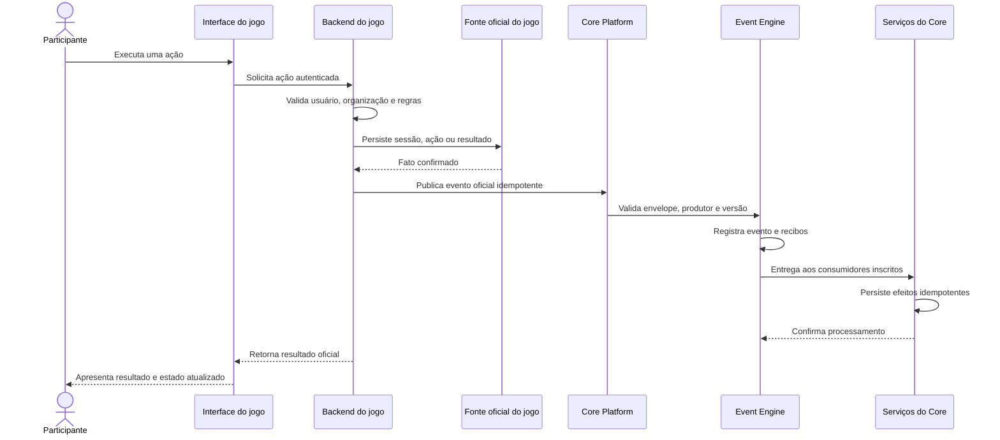
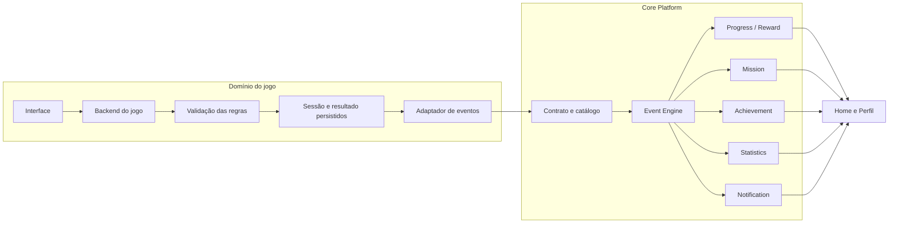

# Game Integration Contract

Status: **Aprovado em 21/07/2026 para orientar integrações futuras**

Este documento define o contrato entre qualquer jogo e o Core Platform do **Conte os Feitos**. Ele estabelece limites, ciclo de vida, resultado normalizado e eventos necessários para que jogos atuais e futuros integrem progressão, missões, conquistas, estatísticas, recompensas e notificações sem conhecer a implementação interna desses serviços.

O servidor continua sendo a fonte da verdade. O navegador solicita ações e apresenta resultados, mas não pode declarar conclusão, pontuação, XP, moedas, progresso, conquistas ou recompensas.

## Princípios do contrato

- Cada jogo é proprietário de suas regras, sessões e resultados.
- O Core Platform é proprietário da progressão e dos efeitos compartilhados.
- Um resultado somente pode ser integrado depois de validado e persistido pelo servidor do jogo.
- A integração ocorre por eventos oficiais, versionados e idempotentes.
- Eventos descrevem fatos ocorridos; não são comandos enviados pelo cliente.
- `gameId` deve existir no catálogo oficial e estar habilitado para integração.
- Usuário e organização são obtidos de contexto confiável, nunca aceitos como autoridade a partir do navegador.
- O mesmo fato não pode gerar efeitos duplicados quando reenviado ou reprocessado.
- Falha no Core não pode apagar, alterar ou invalidar silenciosamente o resultado já persistido pelo jogo.
- `rounds`, `attempts`, Jornadas, Ranking e Medalhas pertencem ao Quiz Bíblico e não formam o modelo universal de novos jogos.

## 1. Responsabilidades dos jogos

Cada jogo deve:

- possuir um `gameId` estável e registrado no `GAME_CATALOG.md`;
- definir suas próprias regras, modos, estados e critérios de validade;
- autenticar a ação e confirmar a propriedade da sessão;
- isolar dados por usuário e organização;
- validar entradas, tempo, ordem, pontuação e conclusão no servidor;
- criar e retomar sessões de forma idempotente;
- persistir o fato principal antes de publicar qualquer evento;
- produzir um resultado normalizado, com versão explícita;
- emitir somente eventos autorizados para seu produtor e sua versão;
- utilizar identificadores determinísticos ou persistidos como origem dos eventos;
- distinguir sessões concluídas, abandonadas, canceladas e invalidadas;
- impedir que dados competitivos informados pelo cliente se tornem oficiais;
- preservar seus dados específicos sem transferi-los desnecessariamente ao Core;
- fornecer testes contratuais para resultado, eventos, repetição e isolamento.

O jogo não pode conceder diretamente XP, moedas, Conquistas, progresso de Missão ou recompensas globais.

## 2. Responsabilidades da plataforma

O Core Platform deve:

- manter o catálogo oficial de jogos e produtores autorizados;
- validar envelope, tipo, versão, origem, usuário, organização e `gameId`;
- rejeitar eventos desconhecidos, incompatíveis ou excessivos sem efeitos parciais;
- persistir eventos aceitos no ledger oficial;
- entregar eventos somente aos consumidores inscritos;
- garantir idempotência por evento, consumidor e versão do handler;
- permitir retomada após falhas sem repetir efeitos concluídos;
- manter Progress, Reward, Achievement, Mission, Statistics e Notification desacoplados do jogo;
- calcular e persistir progressão e recompensas exclusivamente no servidor;
- retornar estados vazios seguros quando um serviço ainda não possuir dados;
- preservar rastreabilidade, diagnóstico e auditoria operacional;
- não reinterpretar ou recalcular o resultado oficial da partida;
- não modificar dados internos do jogo por meio de consumidores do Core.

## 3. Ciclo de vida de uma sessão

O contrato reconhece os seguintes estados de integração. O jogo pode possuir estados internos adicionais, desde que os mapeie de forma inequívoca:

| Estado | Significado para integração | Eventos comuns permitidos |
| --- | --- | --- |
| `created` | Sessão persistida, ainda sem atividade confirmada. | Nenhum obrigatório. |
| `in_progress` | Sessão iniciada e elegível para continuidade. | `GAME_STARTED`, uma única vez. |
| `completed` | Estado final válido segundo as regras do jogo. | `GAME_FINISHED`, uma única vez. |
| `abandoned` | Interrompida e encerrada pela regra do jogo. | Evento específico futuro, se aprovado; nunca simular conclusão. |
| `cancelled` | Cancelada por regra operacional ou administrativa. | Evento específico futuro, se aprovado. |
| `invalidated` | Resultado preservado como evidência, mas inelegível para efeitos oficiais. | Evento específico futuro, se aprovado; não emitir conclusão válida. |

Regras do ciclo:

1. criação e início repetidos recuperam a mesma sessão quando a regra exigir;
2. `GAME_STARTED` representa a criação de uma sessão efetivamente iniciada, não apenas a abertura de uma tela;
3. ações intermediárias são validadas e persistidas pelo jogo;
4. `QUESTION_ANSWERED` somente é emitido após a resposta ter sido persistida e corrigida no servidor;
5. a finalização é idempotente e deriva o resultado dos dados persistidos;
6. `GAME_FINISHED` somente representa uma conclusão válida e final;
7. retomar uma sessão não emite outro `GAME_STARTED` para o mesmo início;
8. treino, competição e outros modos permanecem distinguíveis no resultado validado;
9. uma sessão inválida, cancelada, abandonada ou incompleta não pode ser apresentada ao Core como concluída;
10. o Core pode processar efeitos secundários depois da resposta principal sem alterar o fato original.

## 4. Estrutura padrão do resultado de uma partida

O resultado normalizado é produzido internamente pelo backend do jogo. Ele não é um payload confiável vindo do cliente e não precisa ser exposto integralmente na API pública.

```ts
type GameSessionResult<TGameMetrics extends Record<string, unknown>> = {
  contractVersion: number;
  sessionId: string;
  gameId: string;
  organizationId: string;
  userId: string;
  status: "completed" | "abandoned" | "cancelled" | "invalidated";
  mode: string;
  startedAt: number;
  finishedAt: number;
  durationMs: number;
  score: number | null;
  outcome: "completed" | "won" | "lost" | "draw" | null;
  metrics: {
    common: Record<string, number | string | boolean | null>;
    game: TGameMetrics;
  };
  integrity: {
    valid: boolean;
    reasonCode?: string;
  };
};
```

Essa estrutura é um contrato conceitual. Sua futura representação em tipos ou persistência exige implementação versionada e testes próprios.

## 5. Campos obrigatórios

| Campo | Regra |
| --- | --- |
| `contractVersion` | Inteiro positivo reconhecido para o jogo. |
| `sessionId` | Identificador estável da sessão na fonte oficial do jogo. |
| `gameId` | Slug estável presente no catálogo oficial. |
| `organizationId` | Obtido da sessão ou do registro persistido. |
| `userId` | Proprietário confirmado da sessão. |
| `status` | Estado final mapeado e validado pelo jogo. |
| `mode` | Enum definido e versionado pelo jogo. |
| `startedAt` | Timestamp confiável registrado no servidor. |
| `finishedAt` | Timestamp confiável, posterior ou igual ao início conforme a regra. |
| `durationMs` | Duração calculada ou normalizada pelo servidor; nunca pelo relógio do cliente. |
| `score` | Pontuação interna normalizada quando aplicável; `null` quando o jogo não usa pontuação. |
| `outcome` | Resultado semântico quando aplicável; não substitui métricas específicas. |
| `metrics.common` | Apenas métricas comuns aprovadas no contrato vigente. |
| `metrics.game` | Dados específicos validados pelo schema do jogo. |
| `integrity.valid` | Elegibilidade do resultado para eventos oficiais de conclusão. |

Restrições:

- timestamps, duração, score e métricas competitivas são calculados no servidor;
- strings devem ser normalizadas e possuir limites explícitos;
- objetos não aceitam campos desconhecidos sem nova versão compatível;
- o resultado não deve carregar senha, token, cookie, resposta secreta ou dado pessoal desnecessário;
- `integrity.valid=false` impede emissão de `GAME_FINISHED` como conclusão válida.

## 6. Campos específicos por jogo

Dados particulares ficam em `metrics.game` e precisam de schema versionado próprio. Eles não devem alterar o significado dos campos comuns.

Exemplos conceituais:

| Jogo | Métricas específicas possíveis | Observação |
| --- | --- | --- |
| Quiz Bíblico | `questionsAnswered`, `correctAnswers`, `maxStreak`, `journeyId`, `attemptMode` | A integração futura não pode modificar Ranking ou Medalhas de Jornada. |
| Wordle Bíblico | `guessesUsed`, `wordLength`, `solved` | A palavra secreta nunca integra o evento. |
| Jogo das 3 Pistas | `cluesUsed`, `solved`, `category` | Conteúdo secreto ou respostas futuras permanecem no jogo. |

Regras:

- o namespace específico pertence ao jogo;
- consumidores genéricos ignoram campos específicos que não conhecem;
- um consumidor específico exige cadastro formal e versão compatível;
- mudança de significado requer nova versão, não reaproveitamento silencioso;
- métricas específicas não concedem recompensas diretamente;
- nenhum jogo pode escrever no namespace de outro jogo.

## 7. Eventos emitidos

### Eventos comuns iniciais

| Evento | Momento de emissão | Origem recomendada |
| --- | --- | --- |
| `GAME_STARTED` | Após persistir o início válido da sessão. | `gameId + sessionId + started`. |
| `QUESTION_ANSWERED` | Após persistir e corrigir uma resposta, para jogos compatíveis. | `gameId + answerId`. |
| `GAME_FINISHED` | Após persistir a conclusão e o resultado final válido. | `gameId + sessionId + finished`. |

O `eventId` deve ser estável para o mesmo fato. Repetir a requisição, retomar a sessão ou recuperar uma falha não pode gerar outro identificador para o mesmo início, resposta ou término.

### Envelope oficial

Todo evento segue `CorePlatformEvent` definido em `CORE_PLATFORM_EVENT_ENGINE.md`, contendo:

- `eventId`;
- `eventType`;
- `occurredAt`;
- `organizationId`;
- `userId`;
- `source.kind = "game"`;
- `source.service` autorizado;
- `source.gameId`;
- `source.sourceId`;
- `payload` validado;
- `version`;
- `correlationId` e `causationId`, quando aplicáveis.

`GAME_FINISHED` é o único evento canônico de término para todos os jogos, inclusive o Quiz. Eventos específicos de conclusão não são permitidos sem uma nova decisão arquitetural que substitua explicitamente esta regra.

### Versões de `GAME_FINISHED`

- **v1 (legado compatível):** `{ status, score? }`. Continua aceito pelo Event Engine, pela outbox, pelo dispatcher e pelo Statistics Consumer.
- **v2 (atual para novos resultados do Quiz):** `{ status, score, mode, correctAnswers, questionsAnswered, completedAt, attemptId, gameVersion }`.

No v2, `correctAnswers` não pode superar `questionsAnswered`, `questionsAnswered` deve ser positivo, `completedAt` deve coincidir com `occurredAt` e `attemptId` deve coincidir com `source.sourceId`. O adaptador do Quiz produz somente v2 para fatos novos. Registros v1 permanecem imutáveis e não são convertidos ou enriquecidos retroativamente.

### Consumo de recompensa

O consumidor `reward-progress` versão `1` aceita somente `GAME_FINISHED` v2 oficial. O contrato v1 continua válido para compatibilidade e Statistics, mas Reward o encerra sem efeito e sem retry porque ele não contém métricas suficientes para comprovar elegibilidade. Treino também é encerrado sem recompensa. Toda mutação de XP, moedas e nível ocorre exclusivamente pelo Progress Service.

## Estratégia obrigatória do produtor

Todo backend de jogo deverá gravar o resultado final e uma entrada de outbox no mesmo limite atômico do D1. A entrada usará uma chave determinística derivada de `gameId + sessionId + fato`, preservará o envelope canônico e permanecerá pendente até confirmação durável do Event Engine.

O produtor não poderá:

- chamar diretamente Progress, Reward, Achievement, Mission ou Statistics;
- gerar novo `eventId` ao repetir uma entrega;
- confirmar integração com o Core antes de persistir a outbox;
- emitir `GAME_FINISHED` para sessão inválida, incompleta, abandonada ou não elegível;
- apagar o item da outbox antes da confirmação; o encerramento será marcado por estado/checkpoint.

A tabela e o adaptador concretos serão implementados junto à integração do Quiz, pois dependem do limite transacional da finalização existente. Até lá, nenhum produtor real poderá ser ativado.

## 8. Regras de validação

Antes da publicação, o backend do jogo valida:

- sessão existente, pertencente ao usuário e à organização corretos;
- usuário ativo e autorizado;
- jogo publicado e produtor autorizado;
- transição de estado permitida;
- entradas, ordem, tempo e resultado conforme as regras do jogo;
- resultado derivado exclusivamente de registros persistidos;
- versão conhecida do resultado;
- ausência de campos inesperados ou payload excessivo;
- identificadores, enums, timestamps e limites numéricos;
- elegibilidade do modo para o evento emitido;
- unicidade da origem do fato.

Antes da entrega, o Event Engine valida:

- tipo e versão cadastrados;
- envelope completo;
- produtor compatível com tipo e `gameId`;
- usuário e organização existentes e coerentes;
- timestamp dentro da tolerância aprovada;
- payload compatível com o schema exato;
- reutilização de `eventId` somente para o mesmo fato imutável;
- consumidores oficialmente registrados.

Falhas de validação não podem criar evento parcial, progresso, estatística, missão, conquista, recompensa ou notificação.

## 9. Limites de responsabilidade

| Responsabilidade | Jogo | Core Platform |
| --- | --- | --- |
| Regras e conteúdo da partida | Fonte da verdade | Não interpreta. |
| Sessão, retomada e resultado | Fonte da verdade | Recebe fatos validados. |
| Pontuação interna | Calcula e persiste | Pode projetar, não recalcula. |
| Ranking e premiação específicos | Domínio do jogo | Não altera sem contrato formal. |
| Emissão do evento | Produz após persistência | Valida e registra. |
| Idempotência do fato | Garante origem estável | Garante ledger e recibos por consumidor. |
| XP, moedas e nível global | Não concede | Fonte da verdade nos serviços próprios. |
| Missões e Conquistas globais | Não conclui diretamente | Avalia eventos e persiste estados. |
| Estatísticas compartilhadas | Fornece fatos | Mantém projeções reconstruíveis. |
| Notificações da plataforma | Não cria diretamente | Comunica fatos já confirmados. |

Uma falha do Core não autoriza o jogo a recalcular ou reenviar um novo fato com outro `eventId`. Uma falha do jogo não pode ser compensada pelo Core inventando o resultado.

## 10. Estratégia para novos jogos

Todo novo jogo deve seguir este processo:

1. registrar nome, slug e status no `GAME_CATALOG.md`;
2. documentar objetivo, mecânica, modos e ciclo de sessão;
3. definir schema versionado de resultado e métricas específicas;
4. escolher somente eventos comuns necessários;
5. justificar qualquer evento específico adicional;
6. registrar produtor e serviço autorizados no catálogo do Event Engine;
7. definir chaves idempotentes de início, ações e conclusão;
8. mapear consumidores elegíveis sem acoplamento direto;
9. revisar privacidade, retenção e dados presentes no payload;
10. criar testes de contrato, concorrência, isolamento, reenvio e falha;
11. validar estado vazio e incompatibilidade de versão;
12. integrar primeiro em ambiente local ou isolado;
13. registrar desvios relevantes em ADR antes da implementação;
14. publicar somente após aprovação do contrato e dos testes.

Adicionar um jogo não deve exigir mudanças nas APIs públicas dos serviços centrais. Normalmente, a extensão deve limitar-se ao catálogo, adaptador do produtor, schema de resultado/evento e testes. Mudanças em Progress, Mission, Achievement, Statistics, Reward ou Notification somente são permitidas quando representarem uma capacidade realmente compartilhada.

## Fluxo completo de integração





## Critérios de aprovação de uma integração

Uma integração somente está pronta quando:

- resultado e eventos possuem versão documentada;
- produtor e `gameId` estão autorizados;
- cliente não controla campos competitivos ou recompensas;
- repetição e concorrência não duplicam fatos ou efeitos;
- falha de consumidor permite retomada;
- isolamento entre usuários e organizações foi testado;
- eventos inválidos não geram efeitos parciais;
- métricas e dados específicos respeitam minimização e privacidade;
- o jogo continua funcional mesmo se um efeito secundário do Core falhar;
- documentação, diagnóstico e testes operacionais foram atualizados.

Mudanças relevantes neste contrato exigem nova versão ou ADR. Aprovar este documento não integra automaticamente o Quiz Bíblico nem autoriza migrations, APIs ou produtores novos.
