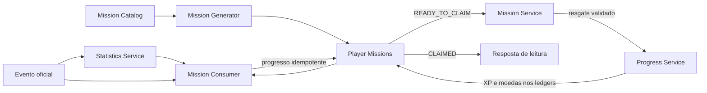

# Mission System Architecture

Status: **Aprovado para orientar a implementação da Sprint 3.7**

Este documento define a arquitetura oficial do sistema de missões do Core Platform do **Conte os Feitos**. Ele complementa `CORE_PLATFORM_ARCHITECTURE.md` e `CORE_PLATFORM_MISSION_IMPLEMENTATION.md`, sem alterar o comportamento implementado até esta sprint.

O servidor permanece como fonte da verdade. O cliente pode consultar missões e solicitar o resgate permitido, mas não pode atribuir missão, declarar progresso, concluir objetivos nem conceder recompensas.

## 1. Responsabilidades e limites

O sistema de missões transforma atividade oficial já validada em objetivos temporais ou permanentes. Ele deve:

- selecionar missões a partir de um catálogo versionado;
- materializar missões para um participante e uma organização;
- acompanhar progresso exclusivamente a partir de eventos oficiais;
- controlar disponibilidade, expiração, conclusão e resgate;
- impedir progresso e recompensa duplicados;
- delegar XP e moedas ao Progress Service;
- consultar projeções reconstruíveis no Statistics Service quando o critério exigir um total acumulado.

O sistema não valida resultados de jogos, não lê tabelas internas do Quiz, não calcula pontuação competitiva, não altera Ranking ou Medalhas e não grava diretamente saldos de XP ou moedas.

## 2. Tipos de missão

| Tipo | Janela | Finalidade | Expiração |
| --- | --- | --- | --- |
| `permanent` | Sem janela recorrente | Objetivo duradouro, disponível até ser concluído e resgatado. | Somente por desativação explícita e compatível do catálogo. |
| `daily` | Um dia civil na política de tempo configurada | Retenção diária e objetivos curtos. | Ao fim da janela, salvo se já estiver pronta para resgate conforme a política da definição. |
| `weekly` | Uma semana civil na política configurada | Objetivos de recorrência e maior esforço. | Ao fim da janela, com a mesma regra explícita de resgate. |
| `event` | Intervalo definido por campanha | Objetivo associado a um evento da plataforma. | Na data final do evento ou conforme regra versionada. |

O tipo faz parte da definição versionada. Alterar janela, critério ou recompensa exige nova versão, sem reescrever missões já atribuídas.

## 3. Estados oficiais

| Estado | Significado | Transições permitidas |
| --- | --- | --- |
| `AVAILABLE` | A missão pode ser atribuída, mas ainda não integra a lista ativa do participante. | `IN_PROGRESS` ou `EXPIRED`. |
| `IN_PROGRESS` | A missão foi atribuída e aceita progresso durante a janela válida. | `READY_TO_CLAIM` ou `EXPIRED`. |
| `READY_TO_CLAIM` | A meta foi atingida e a recompensa aguarda resgate idempotente. | `CLAIMED`; expiração somente se a definição declarar essa política antes da atribuição. |
| `CLAIMED` | A recompensa foi persistida nos ledgers oficiais. Estado terminal. | Nenhuma. |
| `EXPIRED` | A missão deixou de ser válida sem resgate. Estado terminal. | Nenhuma. |

### Compatibilidade com a implementação inicial

A implementação anterior persiste `active`, `completed`, `claimed` e `expired`. Até uma evolução formal do modelo persistente, a correspondência conceitual é:

| Estado persistido atual | Estado arquitetural |
| --- | --- |
| ausência de atribuição elegível no catálogo | `AVAILABLE` |
| `active` | `IN_PROGRESS` |
| `completed` | `READY_TO_CLAIM` |
| `claimed` | `CLAIMED` |
| `expired` | `EXPIRED` |

Essa correspondência não autoriza migration ou renomeação automática. Qualquer alteração persistente futura deverá ser aditiva, preservar registros existentes e ser acompanhada por testes de transição e rollback.

## 4. Fluxo de progresso

1. Um produtor autorizado persiste um fato de negócio e emite um evento oficial pelo Event Engine.
2. O Statistics Service atualiza primeiro as projeções necessárias.
3. O Mission Consumer recebe o mesmo evento após as dependências declaradas.
4. O consumidor localiza somente `Player Missions` em `IN_PROGRESS`, dentro da janela e compatíveis com tipo, escopo e jogo.
5. Para critérios incrementais, aplica o incremento uma única vez por identidade de evento e missão.
6. Para critérios acumulados, consulta o Statistics Service e compara a projeção atual com a meta versionada.
7. Ao atingir a meta, persiste `READY_TO_CLAIM`; isso não concede recompensa automaticamente, salvo política futura explicitamente aprovada.
8. No resgate, o Mission Service solicita XP e moedas ao Progress Service usando identidades determinísticas.
9. Somente depois de todos os efeitos persistirem de forma atômica ou retomável, a missão passa a `CLAIMED`.
10. Missões vencidas que ainda aceitam expiração passam deterministicamente a `EXPIRED`.

Replay, retry e concorrência devem convergir para um único progresso, uma única conclusão e uma única recompensa. O recibo do Event Engine não substitui as constraints e ledgers do domínio de Missões.

## 5. Relação entre Statistics, Progress e Mission Consumer

### Statistics Service

- oferece projeções reconstruíveis de atividade global e por jogo;
- deve ser processado antes do Mission Consumer quando a missão depende do total resultante do evento atual;
- não armazena estado, recompensa ou definição de missão;
- nunca é usado para conceder saldo diretamente.

### Mission Consumer

- é o único consumidor oficial responsável por interpretar eventos para progresso de missão;
- usa o catálogo estruturado e a missão materializada, sem regras paralelas;
- lê Statistics quando necessário e nunca consulta persistência interna de jogos;
- registra checkpoints idempotentes por evento e missão;
- não escreve diretamente nos ledgers de XP ou moedas.

### Progress Service

- permanece proprietário de XP, moedas e nível derivado;
- recebe do Mission Service uma concessão validada, limitada e identificada;
- garante ledger determinístico, replay seguro e isolamento por usuário e organização;
- não decide se uma missão foi concluída.

Não são permitidas dependências circulares. Progress não chama Mission; Statistics não chama Mission; o Mission Consumer coordena somente a avaliação, e o Mission Service coordena somente o ciclo da missão e o resgate.

## 6. Mission Catalog

O **Mission Catalog** é a fonte oficial, estruturada e versionada das definições. Nesta sprint o conceito é definido, mas nenhum catálogo é criado.

Cada definição futura deverá declarar, no mínimo:

- identidade estável e versão;
- tipo (`permanent`, `daily`, `weekly` ou `event`);
- título e descrição;
- escopo global ou por jogo;
- filtro de jogos permitido;
- critério, métrica, operador e meta;
- dificuldade;
- pool de seleção;
- janela e política de expiração;
- cooldown;
- recompensa declarativa;
- status editorial e período de validade.

O catálogo não contém progresso de participante. Definições publicadas são imutáveis; correções relevantes originam uma nova versão. O Mission Consumer não pode manter uma segunda lista de critérios no código.

## 7. Mission Generator

O **Mission Generator** seleciona definições elegíveis e materializa `Player Missions`. Ele não inventa critérios, recompensas ou textos fora do catálogo.

Responsabilidades futuras:

- considerar organização, usuário, janela, tipo e jogos habilitados;
- excluir missões em cooldown ou incompatíveis com o participante;
- escolher dentro de pools usando estratégia determinística e auditável;
- evitar repetição excessiva;
- respeitar dificuldade e disponibilidade do catálogo;
- produzir a mesma atribuição em chamadas concorrentes para a mesma janela;
- retornar estado vazio seguro quando nenhum candidato for elegível.

A seleção aleatória, se usada, deve partir de uma semente determinística da janela e não pode permitir ao cliente escolher uma missão mais vantajosa.

## 8. Player Missions

**Player Missions** são instâncias atribuídas a um usuário dentro de uma organização. Elas preservam a versão da definição usada na atribuição e contêm somente o estado necessário ao ciclo individual:

- identidade da atribuição;
- usuário e organização;
- definição e versão;
- janela aplicável;
- estado oficial;
- progresso atual e meta materializada;
- datas de atribuição, atualização, conclusão, resgate e expiração;
- referência idempotente dos eventos processados;
- referência determinística das recompensas concedidas.

Uma missão atribuída não muda retroativamente quando o catálogo evolui. Dados de outra organização ou usuário nunca podem ser consultados ou atualizados.

## 9. Cooldown

Cooldown é o intervalo mínimo antes que a mesma definição, família ou objetivo possa voltar a ser atribuído ao participante.

- é declarado e versionado no catálogo;
- começa no ponto definido pela política: atribuição, expiração ou resgate;
- é calculado no servidor com relógio confiável;
- não altera missões já materializadas;
- deve ser consultável pelo Generator sem varrer todo o histórico;
- falhas e retries não reiniciam o intervalo;
- pode variar por tipo e pool, mas nunca por valor enviado pelo cliente.

## 10. Pools

Pools agrupam missões compatíveis com um contexto de seleção, por exemplo `daily_global_beginner` ou `weekly_quiz_intermediate`.

- uma definição pode pertencer somente aos pools explicitamente declarados;
- o Generator seleciona primeiro o pool elegível e depois uma definição;
- pools não duplicam critérios nem recompensas;
- pesos futuros devem ser versionados e auditáveis;
- um pool vazio gera estado vazio, não fallback silencioso para missão incompatível;
- eventos e jogos indisponíveis eliminam seus pools da seleção.

## 11. Dificuldade

A dificuldade representa esforço esperado, não autoridade para conceder recompensas arbitrárias. O conjunto oficial inicial é conceitual:

- `easy`;
- `medium`;
- `hard`;
- `expert`.

Metas e recompensas continuam explícitas na definição. O Generator pode usar dificuldade para variedade e progressão, mas não deve inferi-la apenas pelo nível do usuário nem modificar a meta depois da atribuição.

## 12. Filtro por jogo

Uma missão pode ser:

- global, aceitando eventos de qualquer jogo autorizado compatível;
- vinculada a um único `gameId` oficial;
- vinculada a um conjunto explícito de jogos;
- independente de jogo, quando consumir eventos da própria plataforma.

O filtro usa o `gameId` validado do envelope oficial. Slugs, nomes visuais e valores enviados pelo navegador não são fonte de autoridade. Jogos planejados ou desabilitados não entram na seleção. A inclusão de um novo jogo deve ocorrer no catálogo oficial de jogos e depois nas definições ou pools, sem condicionais específicas dentro do Mission Consumer.

## 13. Idempotência, atomicidade e falhas

- progresso usa unicidade por missão atribuída e evento oficial;
- conclusão usa transição condicional de estado;
- resgate usa identidade determinística por atribuição, recompensa e versão;
- XP e moedas são concedidos exclusivamente pelos ledgers do Progress Service;
- uma falha não pode produzir `CLAIMED` sem recompensa persistida nem recompensa sem caminho determinístico para concluir o estado;
- consumidores usam os mecanismos de retry, lease e dead letter do Event Engine;
- erros operacionais são sanitizados e não expõem payload, sessão ou dados de outro usuário;
- expiração e geração concorrentes devem usar constraints e escritas condicionais, nunca somente verificações em memória.

## 14. Decisões reservadas para implementação futura

Este documento não define um catálogo concreto nem autoriza código, migration ou integração. Antes da implementação funcional deverão ser aprovados:

1. catálogo inicial e política editorial;
2. timezone oficial de cada tipo de janela;
3. política de resgate após o fim da janela;
4. critérios e eventos suportados pelo Mission Consumer;
5. ordem oficial do consumidor em relação a Statistics, Reward e Achievement;
6. limites de missões simultâneas por tipo;
7. algoritmo determinístico do Generator;
8. índices, retenção e estratégia de reconstrução;
9. UX de missão pronta, expirada e resgatada;
10. política de recompensas por dificuldade.

Qualquer divergência entre esta arquitetura e a implementação inicial deve ser resolvida por decisão explícita e migration aditiva, nunca por reinterpretação silenciosa de dados existentes.
