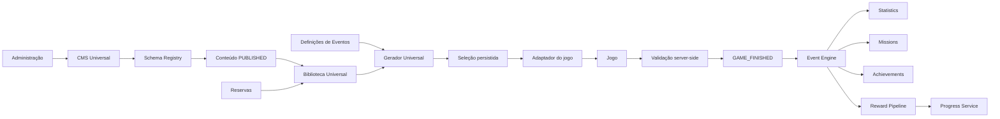
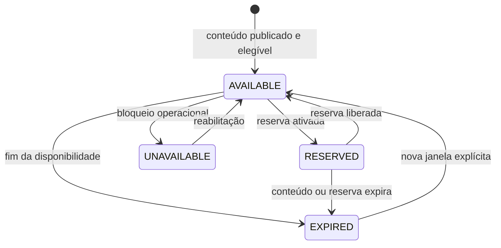
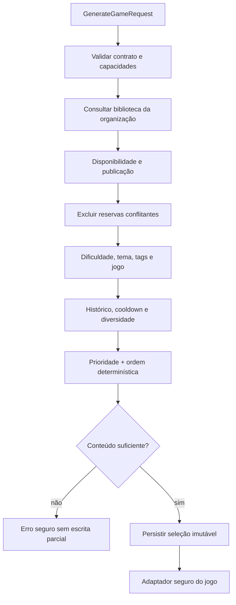
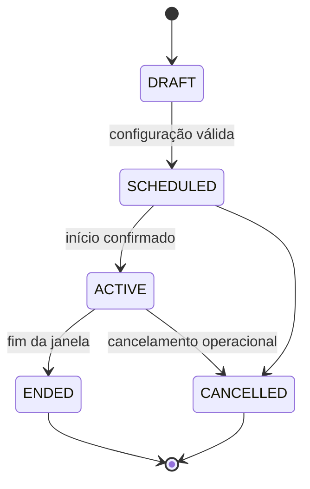
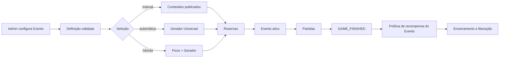
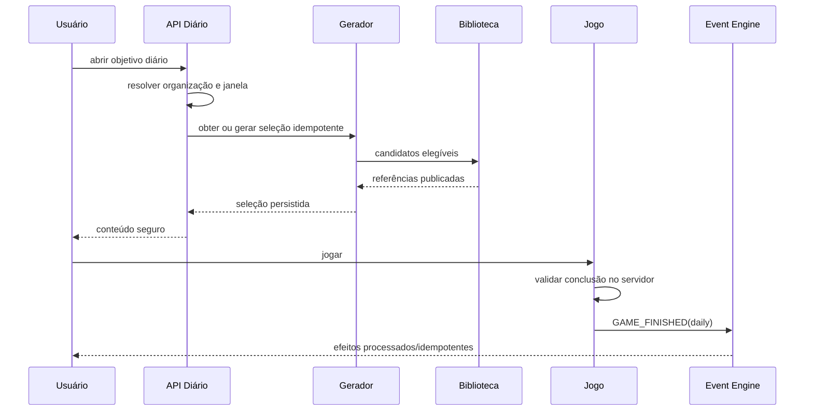
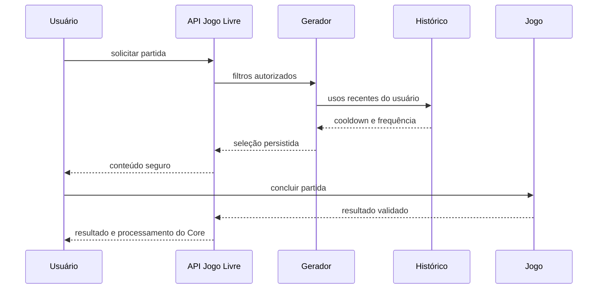
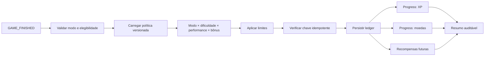

# Architecture Design Document — Fase 4: Plataforma Inteligente

Status: **Proposto para aprovação**

Versão do documento: **1.0**

Escopo: arquitetura da Biblioteca Universal, Gerador Universal de Partidas, Objetivo Diário, Jogo Livre, Eventos e Reward Pipeline.

Este documento define as decisões arquiteturais necessárias para implementar a Fase 4 do **Conte os Feitos**. Ele complementa, sem substituir:

- `CORE_PLATFORM_ARCHITECTURE.md`;
- `CORE_PLATFORM_EVENT_ENGINE.md`;
- `GAME_INTEGRATION_CONTRACT.md`;
- `DOMAIN_MODEL.md`;
- o CMS Universal e o Schema Registry existentes.

Nenhuma seção deste documento autoriza o navegador a conceder recompensas, selecionar outra organização, validar resultados ou acessar conteúdo não publicado.

## 1. Visão geral da arquitetura

A Fase 4 acrescentará uma camada de composição de partidas sobre o conteúdo publicado pelo CMS. Essa camada não será proprietária do conteúdo nem das regras internas dos jogos.

O fluxo canônico será:

1. o CMS valida e publica conteúdo isolado por organização;
2. a Biblioteca Universal projeta a disponibilidade desse conteúdo;
3. reservas retiram temporariamente conteúdos de modos incompatíveis;
4. o Gerador Universal recebe um pedido de partida;
5. o algoritmo filtra e ordena candidatos de maneira determinística;
6. uma seleção imutável é persistida para o modo solicitado;
7. o adaptador do jogo entrega ao cliente apenas dados seguros;
8. o servidor do jogo valida a conclusão;
9. `GAME_FINISHED` alimenta Event Engine, Statistics, Missions, Achievements e Reward;
10. os históricos de uso atualizam futuras seleções, sem alterar retroativamente a partida.



### Limites de domínio

- **CMS Universal:** autoria, validação editorial, versão e publicação.
- **Biblioteca Universal:** consulta e projeção da elegibilidade operacional.
- **Gerador Universal:** seleção e composição de uma partida.
- **Jogo:** apresentação, regras e validação específica.
- **Core Platform:** eventos, estatísticas, progressão e recompensas.
- **Quiz:** continua proprietário de Jornadas, attempts, Ranking e Medalhas.

## 2. Objetivos da Fase 4

- substituir escolhas manuais ou estáticas por seleções governadas;
- reutilizar conteúdos publicados em modos diferentes sem duplicá-los;
- oferecer Objetivo Diário determinístico;
- oferecer Jogo Livre com diversidade e disponibilidade controladas;
- preparar Eventos com conteúdo manual ou automático;
- impedir conflitos entre conteúdos reservados e modos comuns;
- padronizar entradas e saídas para todos os jogos;
- permitir evolução dos algoritmos por versão;
- preservar rastreabilidade da seleção até a conclusão;
- manter segurança, idempotência e isolamento organizacional.

## 3. Problemas que serão resolvidos

| Problema atual ou futuro | Resposta arquitetural |
| --- | --- |
| Jogos escolhem conteúdo de formas diferentes | Gerador Universal com contrato único e adaptadores por jogo. |
| Conteúdo pode se repetir excessivamente | Histórico de uso, cooldown e diversidade. |
| Evento pode perder exclusividade | Reservas com escopo e período explícitos. |
| Seleção diária pode variar entre usuários | Seed versionada e seleção persistida por organização/janela. |
| Alterações no catálogo podem mudar uma partida em andamento | Snapshot imutável de IDs e versões. |
| Recompensas podem divergir por jogo | Reward Policy versionada e fatores normalizados. |
| Novos jogos exigem decisões ad hoc | Registro de capacidades e adaptador conforme contrato. |
| Falhas são difíceis de reproduzir | `selectionId`, seed, versão do algoritmo e trilha de decisão. |

## 4. Princípios arquiteturais

1. **Servidor como fonte da verdade.**
2. **Conteúdo publicado como única fonte jogável.**
3. **Isolamento obrigatório por organização.**
4. **Seleções persistidas são imutáveis.**
5. **Algoritmos e políticas são versionados.**
6. **Determinismo precede aleatoriedade.**
7. **Reservas são explícitas e auditáveis.**
8. **O gerador não conhece respostas secretas além do necessário para filtrar metadados.**
9. **O navegador não recebe respostas corretas.**
10. **Reward não modifica pontuação interna dos jogos.**
11. **Reprocessamento não duplica efeitos.**
12. **Novos jogos entram por capacidades declaradas, não por condicionais espalhadas.**
13. **Nenhuma seleção atravessa limites organizacionais.**
14. **Falha de geração não altera CMS, conteúdo ou progresso.**
15. **Toda decisão automática deve ser explicável por códigos técnicos seguros.**

## 5. Modelo da Biblioteca Universal

### 5.1 Natureza

A Biblioteca Universal será uma projeção consultável sobre conteúdos do CMS com status `PUBLISHED`. Ela não criará uma segunda cópia autoritativa do payload editorial.

Um item da biblioteca referencia uma versão publicada específica:

```ts
type LibraryContentRef = {
  contentId: string;
  contentVersion: number;
  organizationId: string;
  gameType: GameType;
  publishedAt: number;
};
```

### 5.2 Metadados obrigatórios

| Campo | Regra |
| --- | --- |
| `contentId` | ID do CMS, estável dentro da organização. |
| `contentVersion` | Versão exata publicada e jogável. |
| `organizationId` | Autoridade de isolamento. |
| `gameType` | Jogo compatível no Schema Registry e catálogo. |
| `category` | Categoria normalizada para filtragem. |
| `difficulty` | Enum oficial já existente. |
| `status` | Deve resultar em `AVAILABLE` para entrar em geração comum. |
| `publishedAt` | Momento confiável da publicação. |
| `priority` | Inteiro limitado, padrão `0`. |
| `availabilityStart` | Início da elegibilidade operacional. |
| `availabilityEnd` | Fim opcional da elegibilidade. |
| `libraryRevision` | Revisão usada para reprodução da seleção. |

### 5.3 Metadados opcionais

- tags normalizadas;
- referência bíblica;
- tema editorial;
- campanha;
- faixa de idade recomendada;
- capacidades exigidas pelo jogo;
- estimativa de duração;
- peso editorial;
- cooldown recomendado;
- limites de reutilização por janela;
- identificação de coleção;
- idioma e variante;
- classificação interna de sensibilidade;
- `eventOnly`, quando reservado estruturalmente para eventos.

Campos opcionais não podem alterar silenciosamente o significado dos obrigatórios.

### 5.4 Prioridade de uso

`priority` será um inteiro de faixa configurada, inicialmente sugerida entre `-100` e `100`:

- positiva: aumenta a precedência entre candidatos igualmente elegíveis;
- zero: comportamento padrão;
- negativa: reduz uso sem arquivar;
- não supera filtros de segurança, organização, publicação, reserva ou disponibilidade;
- não garante seleção; apenas participa da ordenação ponderada.

Alterações de prioridade afetam somente seleções futuras.

### 5.5 Histórico de utilização

O histórico será append-only ou agregado a partir de registros imutáveis de seleção:

- `selectionId`;
- conteúdo e versão;
- organização;
- modo;
- jogo;
- janela;
- instante da seleção;
- instante da conclusão, quando houver;
- usuário para modos individuais;
- resultado agregado seguro;
- origem: automática ou manual.

O histórico de uso não substitui Statistics. Ele responde “quando este conteúdo foi selecionado”, enquanto Statistics responde “como usuários jogaram”.

### 5.6 Disponibilidade

Um item está elegível somente quando:

```text
CMS status = PUBLISHED
AND organizationId = organização autenticada
AND availabilityStart <= now
AND (availabilityEnd IS NULL OR now < availabilityEnd)
AND library status = AVAILABLE
AND não existe reserva conflitante ativa
AND gameType está habilitado
```

### 5.7 Estados

| Estado | Significado |
| --- | --- |
| `AVAILABLE` | Pode participar de seleções compatíveis. |
| `RESERVED` | Temporariamente exclusivo de um escopo. |
| `UNAVAILABLE` | Excluído operacionalmente sem alterar publicação. |
| `EXPIRED` | Janela de disponibilidade terminou. |

`DRAFT`, `PUBLISHED`, `IN_REVIEW` e `ARCHIVED` continuam sendo estados editoriais do CMS. Não devem ser reutilizados como estados operacionais da biblioteca.



## 6. Gerador Universal de Partidas

### 6.1 Responsabilidade

Selecionar referências de conteúdo elegível e produzir uma composição imutável. Não valida respostas, não entrega recompensas e não altera o CMS.

### 6.2 Entrada

```ts
type GenerateGameRequest = {
  organizationId: string;
  userId?: string;
  gameType: GameType;
  mode: "daily" | "free" | "event" | "custom";
  requestedCount: number;
  difficulty?: Difficulty | readonly Difficulty[];
  categories?: readonly string[];
  tags?: readonly string[];
  eventId?: string;
  windowKey?: string;
  seedContext?: SeedContext;
  exclusions?: readonly string[];
  generatorVersion: number;
};
```

`organizationId` e `userId` vêm da sessão ou do domínio chamador, nunca do navegador como autoridade.

### 6.3 Processamento

1. validar modo, jogo, quantidade e versão;
2. resolver janela e seed;
3. consultar conteúdo publicado da organização;
4. aplicar disponibilidade;
5. aplicar reservas;
6. validar capacidades do jogo;
7. aplicar filtros solicitados;
8. considerar histórico e cooldown;
9. formar grupos de diversidade;
10. ordenar por prioridade e chave pseudoaleatória determinística;
11. selecionar a quantidade requerida;
12. validar suficiência e distribuição;
13. persistir seleção, seed, revisão e motivo;
14. retornar somente referências e dados públicos seguros.

### 6.4 Saída

```ts
type GeneratedGameSelection = {
  selectionId: string;
  organizationId: string;
  gameType: GameType;
  mode: "daily" | "free" | "event" | "custom";
  windowKey: string | null;
  generatorVersion: number;
  seedHash: string;
  libraryRevision: number;
  contents: readonly {
    contentId: string;
    contentVersion: number;
    position: number;
  }[];
  createdAt: number;
  expiresAt: number | null;
};
```

### 6.5 Regras

- a mesma chave idempotente retorna a mesma seleção;
- seleção persistida nunca é recalculada durante uma partida;
- conteúdo insuficiente produz erro explícito, sem seleção parcial;
- nenhuma resposta secreta integra a resposta genérica do gerador;
- seleção manual de evento ainda passa por publicação, organização e versão;
- o gerador não consulta tabelas internas do Quiz;
- adaptadores convertem referências em payloads seguros para cada jogo.

### 6.6 Extensibilidade

Cada jogo declara:

```ts
type GameGenerationCapabilities = {
  gameType: GameType;
  minimumContents: number;
  maximumContents: number;
  supportsDifficulty: boolean;
  supportsCategoryMix: boolean;
  supportsDaily: boolean;
  supportsEvents: boolean;
  adapterVersion: number;
};
```

Adicionar um jogo exige registro de capacidades, schema CMS, adaptador seguro e testes contratuais. O algoritmo central não recebe condicionais por slug.



## 7. Algoritmo de seleção

### 7.1 Filtros obrigatórios, em ordem

1. organização;
2. `PUBLISHED`;
3. jogo;
4. janela de disponibilidade;
5. estado operacional;
6. reserva compatível;
7. versão e schema válidos;
8. capacidades do modo.

### 7.2 Filtros solicitados

- dificuldade ou faixa;
- tema, categoria e tags;
- evento;
- exclusões explícitas;
- conteúdo manual permitido.

### 7.3 Histórico e repetição

- Diário ignora histórico individual para manter igualdade entre usuários;
- Livre considera histórico do usuário e da organização;
- Evento respeita sua seleção fixa ou pool reservado;
- cooldown exclui temporariamente conteúdo recente;
- se a exclusão tornar o pool insuficiente, aplica-se relaxamento versionado e registrado.

Ordem de relaxamento sugerida:

1. ampliar diversidade temática;
2. aceitar conteúdo usado há mais tempo;
3. ampliar dificuldade adjacente, somente se o modo permitir;
4. falhar; nunca atravessar organização ou reserva.

### 7.4 Diversidade

O algoritmo forma buckets por categoria, tema e referência bíblica. A seleção usa round-robin determinístico entre buckets antes de repetir o mesmo grupo.

### 7.5 Ordenação

Para cada candidato:

```text
selectionKey = HMAC_SHA256(
  serverSeedKey,
  seed + contentId + contentVersion + generatorVersion
)
```

A ordenação usa:

1. prioridade decrescente;
2. penalidade de uso crescente;
3. bucket de diversidade;
4. `selectionKey`;
5. `contentId` como desempate final.

A chave secreta nunca é enviada ao cliente. O hash persistido permite auditoria sem revelar a chave.

## 8. Sistema de Seeds e Objetivos Diários

### 8.1 Escopo do determinismo

“Todos os usuários recebem exatamente o mesmo conteúdo” significa: **todos os usuários da mesma organização, jogo, modo, janela diária e versão do gerador** recebem a mesma seleção.

Conteúdos não atravessam organizações. Uma seleção global entre organizações exigiria catálogo compartilhado formal e nova decisão arquitetural.

### 8.2 Seed lógica

```ts
type SeedContext = {
  organizationId: string;
  gameType: GameType;
  mode: "daily";
  windowKey: string; // YYYY-MM-DD no fuso oficial da organização
  generatorVersion: number;
  libraryRevision: number;
};
```

```text
seed = HMAC_SHA256(
  serverSeedKey,
  organizationId | gameType | daily | windowKey | generatorVersion
)
```

`libraryRevision` é registrada na seleção, mas não deve fazer usuários posteriores receberem outro objetivo no mesmo dia. A primeira geração válida persiste a seleção da janela; chamadas seguintes a reutilizam.

### 8.3 Concorrência

- chave única lógica: organização + jogo + modo + janela;
- duas gerações concorrentes disputam a mesma criação;
- o vencedor persiste;
- o perdedor lê e retorna a seleção vencedora;
- falha antes da persistência não consome a janela.

### 8.4 Mudanças durante o dia

- nova publicação não altera objetivo já criado;
- conteúdo arquivado emergencialmente torna a seleção indisponível;
- fallback emergencial exige nova geração explicitamente versionada e auditada;
- recompensas e conclusão preservam a identidade da seleção utilizada.

## 9. Sistema de Reservas

### 9.1 Objetivo

Garantir exclusividade temporária de conteúdos para Eventos, campanhas ou futuras Jornadas Personalizadas.

### 9.2 Modelo conceitual

```ts
type ContentReservation = {
  reservationId: string;
  organizationId: string;
  contentId: string;
  contentVersion?: number;
  ownerType: "event" | "campaign" | "custom_journey";
  ownerId: string;
  exclusiveAgainst: readonly ("daily" | "free" | "event" | "custom")[];
  startsAt: number;
  endsAt: number;
  state: "SCHEDULED" | "ACTIVE" | "RELEASED" | "EXPIRED" | "CANCELLED";
  createdBy: string;
  createdAt: number;
};
```

### 9.3 Regras

- reserva sempre pertence à mesma organização do conteúdo;
- `endsAt > startsAt`;
- reservas incompatíveis não podem se sobrepor;
- `ACTIVE` bloqueia os modos listados em `exclusiveAgainst`;
- reserva para um Evento não bloqueia o próprio Evento;
- liberação antecipada exige auditoria;
- expiração é derivável pelo tempo e pode ser materializada operacionalmente;
- conteúdo arquivado continua indisponível mesmo reservado;
- nenhum cliente cria ou ignora reservas diretamente.

### 9.4 Duração

- começa em `startsAt`;
- termina de forma exclusiva em `endsAt`;
- margem opcional de preparação deve integrar a própria janela;
- duração máxima será política administrativa versionada;
- chamadas de geração avaliam o tempo atual do servidor.

## 10. Eventos da plataforma

### 10.1 Definição

```ts
type PlatformEventDefinition = {
  eventId: string;
  organizationId: string;
  name: string;
  description: string;
  bannerAssetId?: string;
  startsAt: number;
  endsAt: number;
  state: "DRAFT" | "SCHEDULED" | "ACTIVE" | "ENDED" | "CANCELLED";
  participatingGames: readonly GameType[];
  rewardPolicyId: string;
  selectionMode: "manual" | "automatic" | "hybrid";
  generatorVersion: number;
};
```

### 10.2 Conteúdos

- **manual:** lista explícita de `contentId + version`;
- **automático:** filtros e quantidade resolvidos pelo Gerador;
- **híbrido:** conteúdos fixos mais vagas automáticas;
- todos precisam estar publicados e pertencer à organização;
- conteúdos podem ser reservados desde a preparação até o encerramento.

### 10.3 Premiações

- evento referencia política versionada;
- premiação usa Reward Pipeline;
- cliente não informa multiplicadores;
- cancelamento não concede prêmio automático;
- regras competitivas específicas exigem contrato separado;
- Medalhas do Quiz não são substituídas.

### 10.4 Estados



### 10.5 Fluxo



## 11. Objetivo Diário

### Fluxo completo

1. resolver organização, fuso e `windowKey`;
2. buscar seleção diária existente;
3. se ausente, gerar com chave idempotente;
4. persistir antes de responder;
5. entregar conteúdo seguro pelo adaptador;
6. iniciar ou retomar sessão do jogo;
7. validar conclusão no servidor;
8. emitir `GAME_FINISHED` com modo futuro `daily`;
9. Statistics registra conclusão;
10. Mission/Achievement avaliam o fato;
11. Reward aplica política diária uma única vez;
12. Home exibe estado concluído sem recalcular a seleção.



### Regras

- uma seleção por organização, jogo e dia;
- uma recompensa diária elegível por usuário e seleção;
- retomar não gera nova seleção;
- usuário ausente no dia não recebe recompensa retroativa;
- conteúdo invalidado usa procedimento emergencial explícito.

## 12. Jogo Livre

### Fluxo completo

1. usuário escolhe jogo e filtros permitidos;
2. servidor valida capacidades;
3. Gerador consulta biblioteca e histórico individual;
4. conteúdo recente recebe cooldown;
5. diversidade e dificuldade são aplicadas;
6. seleção individual é persistida;
7. adaptador entrega conteúdo seguro;
8. jogo valida conclusão;
9. `GAME_FINISHED` usa modo futuro `free`;
10. Reward aplica política do modo Livre.



### Regras

- usuário não escolhe IDs secretos diretamente;
- filtros não permitem consultar outra organização;
- repetir requisição com mesma chave retorna a seleção existente;
- abandonar não produz conclusão válida;
- seleção expira conforme política do jogo.

## 13. Jornada Personalizada futura

Uma Jornada Personalizada será uma composição criada por administrador ou líder autorizado, independente das Jornadas competitivas do Quiz.

### Conceito

- pode incluir um ou vários jogos;
- possui título, descrição, janela, público e sequência;
- etapas referenciam seleções ou conteúdos publicados;
- pode usar seleção manual, automática ou híbrida;
- reserva conteúdo quando exclusividade for necessária;
- progresso é da Jornada Personalizada, não de `rounds`/`attempts`;
- recompensa usa política própria e versionada;
- não entra no Ranking nem nas Medalhas do Quiz sem decisão formal.

### Limites

- não reutilizar tabelas do Quiz;
- não criar resultados pelo cliente;
- não permitir conteúdo de outra organização;
- não existir antes de um documento e modelo de domínio específicos.

## 14. Reward Pipeline

### 14.1 Objetivo

Calcular recompensas a partir de fatos oficiais e políticas versionadas, mantendo score do jogo separado de XP e moedas.

### 14.2 Entrada conceitual

```ts
type RewardEvaluationContext = {
  eventId: string;
  organizationId: string;
  userId: string;
  gameId: string;
  mode: "daily" | "free" | "event" | "custom";
  difficulty: Difficulty;
  performance: number; // normalizada de 0 a 1 no servidor
  rewardPolicyId: string;
  policyVersion: number;
  bonuses: readonly BonusRef[];
};
```

### 14.3 Fórmula

```text
baseReward
× modeMultiplier
× difficultyMultiplier
× performanceMultiplier
× bonusMultiplier
= boundedReward
```

Cada fator:

- é resolvido por política persistida ou catálogo versionado;
- possui limite mínimo e máximo;
- é calculado no servidor;
- é registrado no ledger;
- não altera a pontuação do jogo;
- não é aceito do navegador.

### 14.4 Modos

- `daily`: bônus controlado por uma recompensa por janela;
- `free`: multiplicador padrão;
- `event`: política do Evento;
- `custom`: política da Jornada Personalizada.

### 14.5 Performance

Cada adaptador do jogo produz métrica normalizada aprovada:

- acurácia;
- número de tentativas;
- pistas utilizadas;
- movimentos;
- tempo, apenas quando confiável e necessário.

O Reward Pipeline recebe a métrica validada, não o histórico secreto.

### 14.6 Idempotência

Chave:

```text
eventId + rewardPolicyId + policyVersion + rewardComponent
```

Replay retorna o ledger existente. Falha parcial retoma componentes pendentes sem repetir os concluídos.



## 15. Escalabilidade e novos jogos

### Integração obrigatória

Um novo jogo precisa fornecer:

1. `GameType` e catálogo;
2. schema CMS;
3. capacidades de geração;
4. adaptador de conteúdo seguro;
5. validação server-side;
6. contrato de conclusão;
7. métrica de performance normalizada, se aplicável;
8. testes de isolamento, versão, segredos e idempotência.

### Escala de leitura

- índices por organização, jogo, status, disponibilidade e prioridade;
- paginação/cursor para pools grandes;
- projeção de metadados sem carregar payload secreto;
- cache somente de metadados públicos e nunca de APIs autenticadas;
- seleção persistida reduz recomputação;
- consultas limitadas por organização.

### Escala de escrita

- seleções append-only;
- agregados de uso atualizados de forma idempotente;
- concorrência controlada por chaves únicas;
- Event Engine processa efeitos secundários;
- limpeza e retenção seguem políticas explícitas.

### Evolução do algoritmo

- `generatorVersion` fixa comportamento;
- versão antiga continua reproduzível;
- nova versão não recalcula seleções existentes;
- rollout pode ocorrer por organização;
- métricas comparam versões sem misturar resultados.

## 16. APIs futuras necessárias

As rotas abaixo são propostas, não implementadas.

### Participante

| Método | Rota conceitual | Finalidade |
| --- | --- | --- |
| `GET` | `/api/platform/daily/:gameType` | Obter ou criar seleção diária idempotente. |
| `POST` | `/api/platform/free/:gameType/sessions` | Gerar partida Livre. |
| `GET` | `/api/platform/selections/:id` | Retomar seleção pertencente ao usuário. |
| `GET` | `/api/platform/events` | Listar Eventos visíveis e ativos. |
| `POST` | `/api/platform/events/:id/sessions` | Iniciar seleção do Evento. |

### Administração

| Método | Rota conceitual | Finalidade |
| --- | --- | --- |
| `GET/PATCH` | `/api/admin/library/:contentId` | Consultar/ajustar metadados operacionais. |
| `GET/POST` | `/api/admin/reservations` | Administrar reservas autorizadas. |
| `GET/POST/PATCH` | `/api/admin/platform-events` | Administrar Eventos. |
| `POST` | `/api/admin/generator/preview` | Pré-visualizar seleção sem criar partida. |
| `GET` | `/api/admin/generator/diagnostics` | Inspecionar suficiência e conflitos. |

### Regras comuns

- autenticação obrigatória;
- organização derivada da sessão;
- autorização server-side;
- `Cache-Control: no-store` para dados autenticados;
- limites e rate limit;
- respostas sem segredos;
- erros específicos sem stack trace;
- preview não concede recompensas nem consome seleção.

## 17. Alterações futuras no banco

Nenhuma migration é criada nesta sprint. Futuramente serão avaliadas tabelas aditivas para:

1. `content_library_metadata`;
2. `content_reservations`;
3. `game_generation_selections`;
4. `game_generation_selection_items`;
5. `content_usage_history`;
6. `platform_event_definitions`;
7. `platform_event_games`;
8. `platform_event_contents`;
9. `reward_policy_definitions`;
10. checkpoints auxiliares de geração, se estritamente necessários.

### Índices previstos

- biblioteca: organização + jogo + estado + disponibilidade;
- reservas: organização + conteúdo + estado + período;
- seleções: organização + modo + jogo + janela;
- itens: seleção + posição; conteúdo + versão;
- histórico: organização + usuário + jogo + selecionado em;
- Eventos: organização + estado + período.

### Constraints previstas

- chaves estrangeiras para conteúdo e organização quando compatíveis;
- unicidade da seleção diária;
- posições únicas por seleção;
- intervalo temporal válido;
- estados limitados;
- payloads versionados e limitados;
- nenhuma deleção em cascata que apague histórico operacional.

## 18. Estratégia de migração

### Etapa 1 — Projeção sem impacto

- criar metadados operacionais para conteúdos já publicados;
- preencher defaults seguros;
- manter jogos consumindo endpoints atuais;
- comparar biblioteca projetada com CMS.

### Etapa 2 — Gerador em shadow mode

- gerar seleções sem entregá-las ao usuário;
- comparar suficiência, diversidade e determinismo;
- registrar apenas métricas técnicas;
- não conceder recompensas.

### Etapa 3 — Objetivo Diário controlado

- habilitar por organização;
- persistir seleções;
- adaptar um jogo primeiro;
- manter fallback para o fluxo atual;
- observar falhas e consistência.

### Etapa 4 — Jogo Livre

- migrar jogos gradualmente;
- preservar endpoints atuais até equivalência;
- evitar duas conclusões para a mesma sessão.

### Etapa 5 — Eventos

- iniciar com seleção manual;
- adicionar automática após diagnóstico;
- ativar reservas antes do primeiro Evento.

### Rollback

- feature flags server-side por modo e organização;
- seleções existentes permanecem legíveis;
- desabilitar gerador não altera CMS ou progressão;
- endpoints atuais continuam disponíveis durante transição;
- migrations são aditivas;
- nunca apagar histórico para reverter comportamento.

## 19. Riscos e mitigação

| Risco | Impacto | Mitigação |
| --- | --- | --- |
| Catálogo insuficiente | Geração falha ou repete conteúdo | Diagnóstico de suficiência e falha explícita. |
| Mudança de conteúdo durante partida | Resultado não reproduzível | Fixar `contentVersion` na seleção. |
| Seed divergente | Usuários recebem Diários diferentes | Seleção única persistida por janela. |
| Corrida na primeira geração | Duas seleções diárias | Constraint lógica e leitura do vencedor. |
| Reserva ignorada | Conteúdo exclusivo aparece no Livre | Filtro obrigatório antes de qualquer ponderação. |
| Reserva sobreposta | Ambiguidade operacional | Validação transacional de conflito. |
| Resposta secreta exposta | Compromete jogo | Adaptadores seguros e testes contratuais. |
| Multiplicador adulterado | Economia inflacionada | Política e performance resolvidas no servidor. |
| Recompensa duplicada | Integridade da progressão | Ledger idempotente por componente. |
| Algoritmo não reproduzível | Auditoria impossível | Versão, seed hash, revisão e decisão persistidas. |
| Histórico cresce indefinidamente | Performance | Índices, agregados e retenção aprovada. |
| Conteúdo atravessa organizações | Violação de segurança | Organização na primeira condição de toda consulta. |
| Novo jogo cria exceções no núcleo | Acoplamento | Capacidades e adaptadores registrados. |
| Evento cancelado após partidas | Inconsistência de produto | Política explícita de cancelamento e preservação dos fatos. |

## 20. Plano de implementação

### Sprint 23.2 — Biblioteca Universal

**Objetivo**

- implementar projeção operacional sobre conteúdo publicado;
- metadados, disponibilidade, prioridade e diagnóstico;
- sem alterar consumo dos jogos.

**Arquivos principais previstos**

- `functions/_lib/universal-content-store.ts`;
- novo módulo interno de biblioteca;
- contratos compartilhados;
- migration aditiva;
- testes unitários e de integração;
- diagnóstico administrativo.

**Impactos**

- novas leituras internas e metadados;
- nenhum endpoint de jogo substituído.

**Riscos**

- divergência entre CMS e projeção;
- defaults incorretos para conteúdo legado.

### Sprint 23.3 — Gerador Universal e Seeds

**Objetivo**

- implementar contrato, capacidades, algoritmo determinístico e snapshots;
- operar inicialmente em testes/shadow mode.

**Arquivos principais previstos**

- módulo interno do gerador;
- catálogo de capacidades;
- persistência de seleções;
- testes de determinismo, concorrência e diversidade.

**Impactos**

- nova infraestrutura interna sem ativação na Home.

**Riscos**

- pools insuficientes;
- seleção não reproduzível;
- concorrência na criação.

### Sprint 23.4 — Objetivo Diário

**Objetivo**

- expor seleção diária para um jogo piloto;
- garantir igualdade por organização/janela e recompensa única.

**Arquivos principais previstos**

- endpoint autenticado diário;
- adaptador do jogo piloto;
- Home, somente integração necessária;
- Reward Policy diária;
- testes end-to-end focados.

**Impactos**

- primeiro uso real do gerador;
- novos modos em `GAME_FINISHED`, mediante versão compatível.

**Riscos**

- fuso e virada de janela;
- conteúdo removido durante o dia;
- recompensa duplicada.

### Sprint 23.5 — Jogo Livre e Reservas

**Objetivo**

- ativar geração individual com histórico e diversidade;
- implementar reservas antes de Eventos.

**Arquivos principais previstos**

- endpoint de sessão Livre;
- serviço de reservas;
- administração mínima de metadados/reservas;
- integrações graduais dos jogos;
- testes de cooldown e exclusividade.

**Impactos**

- substituição progressiva de escolhas diretas;
- histórico de uso passa a influenciar seleção.

**Riscos**

- baixa diversidade;
- conflito de reserva;
- excesso de consultas.

### Sprint 23.6 — Eventos e Reward Pipeline

**Objetivo**

- implementar Eventos inicialmente manuais;
- ativar políticas versionadas e multiplicadores;
- preparar seleção automática.

**Arquivos principais previstos**

- domínio e administração de Eventos;
- contratos de Reward Policy;
- consumidores/ledgers existentes;
- endpoints autenticados;
- testes de ciclo, cancelamento e idempotência.

**Impactos**

- novo modo de participação;
- recompensas contextuais.

**Riscos**

- inflação econômica;
- cancelamento e reservas;
- regras competitivas ambíguas.

## 21. Decisões fechadas

1. O CMS Universal permanece fonte do conteúdo.
2. A Biblioteca Universal é uma projeção operacional, não outro CMS.
3. Conteúdo jogável precisa estar `PUBLISHED`.
4. Toda seleção é isolada por organização.
5. O Diário é igual para usuários da mesma organização e janela.
6. A primeira seleção diária persistida vence e não muda durante a janela.
7. Seleções fixam `contentId` e `contentVersion`.
8. Reservas são avaliadas antes de prioridade e diversidade.
9. Eventos usam seleção manual, automática ou híbrida.
10. O Gerador não valida partidas nem concede recompensas.
11. `GAME_FINISHED` continua como evento canônico.
12. Reward usa política versionada e ledger idempotente.
13. Pontuação do jogo e recompensa da plataforma permanecem separadas.
14. Novos jogos entram por capacidades e adaptadores.
15. A migração será aditiva, gradual e protegida por feature flags.

## 22. Padrões operacionais e questões de produto

Para que a implementação não dependa de decisões arquiteturais adicionais, a Fase 4 adotará os padrões abaixo enquanto o produto não aprovar outra política versionada:

| Tema | Padrão de implementação | Decisão futura permitida |
| --- | --- | --- |
| Fuso sem configuração organizacional | UTC. A janela é calculada e persistida no servidor. | Organização pode receber fuso explícito em evolução própria. |
| Quantidade diária | Uma seleção por organização, jogo habilitado e dia. A Home pode destacar apenas uma delas. | Curadoria pode limitar quais jogos participam. |
| Primeiro jogo piloto | Wordle, por possuir uma unidade de conteúdo pequena e validação server-side consolidada. | Outro piloto exige apenas configuração de capacidade. |
| Validade de seleção Livre | 30 minutos após criação; conclusão já aceita permanece válida. | Política por jogo pode substituir o padrão. |
| Multiplicadores iniciais | Todos começam em `1.0`; a Sprint 23.6 introduz valores somente com testes econômicos. | Produto define faixas sem mudar o pipeline. |
| Evento cancelado | Recompensas já persistidas não são revogadas; novas conclusões deixam de ser iniciadas após cancelamento. | Compensação exige evento e política próprios. |
| Administração de Eventos | Nova permissão server-side `events.manage`; admins continuam cobertos pela política de acesso total. | Mapeamento para líderes será decisão de autorização. |
| Duração máxima de reserva | 90 dias, incluindo margem de preparação. | Exceções exigem justificativa auditada. |
| Catálogo insuficiente | API retorna conflito específico; interface mostra indisponibilidade. Nunca atravessa organização, reserva ou publicação. | Relaxamentos adicionais exigem nova versão do gerador. |

Questões de produto ainda podem alterar textos, quantidades destacadas e valores econômicos, mas não os limites arquiteturais de autoridade, isolamento, idempotência ou versionamento. Mudanças nesses limites exigem ADR.
