# Phase 4 Release Candidate

Status: candidato validado localmente  
Data da auditoria: 03/08/2026  
Commit auditado: `38cb868` (`implement universal platform events`)

## 1. Escopo do candidato

A Fase 4 consolida uma única plataforma de jogos sobre os seguintes limites arquiteturais:

1. o CMS Universal é a fonte de verdade editorial;
2. a Biblioteca Universal é uma projeção operacional somente de conteúdos publicados;
3. o Catálogo Elegível remove conteúdos inválidos, indisponíveis ou reservados;
4. o Gerador Universal produz seleções imutáveis identificadas por `contentId` e `contentVersion`;
5. o Game Loader resolve o provider do modo sem transferir essa decisão para o jogo;
6. as respostas permanecem no servidor e as ações do jogador são revalidadas;
7. conclusões oficiais percorrem o pipeline existente de progressão, estatísticas, missões e conquistas.

```mermaid
flowchart LR
    CMS["CMS Universal"] --> LIB["Biblioteca Universal"]
    LIB --> ELIGIBLE["Catálogo Elegível"]
    ELIGIBLE --> GENERATOR["Gerador Universal"]
    GENERATOR --> SELECTION["Seleção imutável"]
    SELECTION --> LOADER["Game Loader + Provider Registry"]
    LOADER --> GAME["Jogo"]
    GAME --> VALIDATE["Validação server-side"]
    VALIDATE --> FINISH["GAME_FINISHED"]
    FINISH --> CORE["Progress · Statistics · Missions · Achievements"]
```

## 2. Jogos e modos

O catálogo central registra sete jogos disponíveis:

| Jogo | FREE_PLAY | DAILY | EVENT |
| --- | --- | --- | --- |
| Quiz Bíblico | suportado | suportado | provider compatível |
| Wordle Bíblico | suportado | suportado | validado ponta a ponta no RC |
| Linha do Tempo Bíblica | suportado | suportado | provider compatível |
| Memória Bíblica | suportado | suportado | provider compatível |
| Associação de Temas | suportado | suportado | provider compatível |
| Quem Sou Eu? | suportado | suportado | provider compatível |
| Jogo das 3 Pistas | suportado | suportado | provider compatível |

Os testes confirmam que:

- FREE_PLAY cria uma nova seleção para uma nova chave de geração e preserva idempotência da mesma requisição;
- DAILY usa uma seleção determinística por organização, data, jogo e versão do algoritmo;
- DAILY não oferece retomada ou repetição depois do encerramento;
- EVENT fixa seleção e resultado e permite uma tentativa por jogo e usuário;
- abandono encerra a participação como derrota sem conceder recompensa de vitória;
- uma conclusão repetida converge para o mesmo fato;
- o modo faz parte do contrato validado e não pode ser trocado pelo cliente;
- o menu inferior é ocultado enquanto uma partida está ativa;
- o destino de retorno é `/jogos`, `/desafios-diarios` ou o Evento de origem, conforme o modo.

## 3. Conteúdo

### Quiz

O marco operacional informado antes deste gate registra 984 perguntas universais publicadas, projetadas e elegíveis. Esta sprint não acessou o D1 remoto e, portanto, não repetiu essa contagem. O contrato local comprova migração idempotente, isolamento organizacional, publicação, projeção e consumo pelo Gerador.

O fallback `LEGACY_READ_ONLY` ainda existe como ponte transitória quando `QUIZ_LEGACY_FALLBACK_ENABLED` não é `false` e o acervo universal é insuficiente. Ele não escreve, não importa e não mistura fontes numa seleção. Sua remoção está registrada no backlog da Fase 5.

### Conteúdo base oficial

O pacote versionado `content/official-base-content-v1.json` contém exatamente 380 registros:

| Jogo | Total | EASY | MEDIUM | HARD |
| --- | ---: | ---: | ---: | ---: |
| Wordle Bíblico | 120 | 48 | 48 | 24 |
| Linha do Tempo Bíblica | 40 | 10 | 20 | 10 |
| Memória Bíblica | 40 | 16 | 16 | 8 |
| Associação de Temas | 60 | 24 | 24 | 12 |
| Quem Sou Eu? | 60 | 24 | 24 | 12 |
| Jogo das 3 Pistas | 60 | 24 | 24 | 12 |

Os testes locais confirmam validação integral, importação retomável e idempotente, publicação, projeção na Biblioteca e geração DAILY/FREE_PLAY para os seis pacotes. Como não houve acesso remoto nesta sprint, a presença dos 380 registros no D1 de produção deve ser confirmada pelo procedimento operacional antes da promoção do candidato.

Conteúdo reservado por Evento é excluído de DAILY e FREE_PLAY. Cancelamento ou reconciliação do encerramento libera a reserva e restaura `AVAILABLE`. Reservas sobrepostas são rejeitadas e organizações permanecem isoladas.

## 4. Fluxos administrativos

O candidato inclui:

- Central de Conteúdo e dashboard do CMS;
- Acervo Universal com filtros e paginação;
- Editor Universal com Draft, publicação e retorno para Draft;
- histórico de versões e auditoria sanitizada;
- diagnóstico do catálogo e da geração do Quiz;
- dry-run e aplicação protegida do conteúdo base oficial;
- importador administrativo do Quiz legado, separado do fluxo do jogador;
- criação, validação, sugestão/seleção de conteúdo, agendamento e cancelamento de Eventos.

Autenticação, autorização e isolamento por `organizationId` permanecem obrigatórios no servidor. Os fluxos de conteúdo continuam usando `questions.edit`; Eventos usam sua autorização administrativa vigente.

## 5. Eventos

O modo EVENT suporta definições em Draft, janela com fuso, regras `ALL` ou `MINIMUM`, conteúdo manual ou sugerido, seleção imutável, reservas, participação única por jogo, recompensas idempotentes, cancelamento e encerramento reconciliado.

O E2E do release gate cobre criação, validação, agendamento e cancelamento pelo administrador; visibilidade condicional na Home; lista e detalhes para participante; conclusão e abandono; resultado fixo; ausência de replay; menu oculto; e viewport móvel sem overflow impeditivo.

## 6. Migrations

| Migration | Responsabilidade |
| --- | --- |
| `0032_universal_content_library.sql` | Biblioteca Universal e disponibilidade |
| `0033_universal_game_generator.sql` | seleções e itens imutáveis do Gerador |
| `0034_daily_objective_participations.sql` | participação e uso do Objetivo Diário |
| `0035_free_play_participations.sql` | participação FREE_PLAY e compatibilidade de modo |
| `0036_platform_events.sql` | Eventos, jogos, reservas, participações e recompensas |

Localmente, todas as migrations aplicam em ordem sobre banco vazio; a 0036 aplica sobre o estado 0035 sem remover objetos; o reconciliador reconhece o ledger até 0036 e aceita zero migrations pendentes como estado válido.

O ledger remoto não foi consultado nesta sprint por proibição expressa de acesso à produção. Antes da promoção, o processo operacional deve confirmar que produção termina em `0036_platform_events.sql`, que `verify-promotable` informa zero pendências e que `verify-final` reconhece o schema completo. Nenhum workflow precisa ser alterado com base na evidência local.

## 7. Validação do release candidate

O gate é composto por:

- contratos do CMS, conteúdo, catálogo, Loader, modos e navegação;
- integrações dos sete jogos com conteúdo e progressão;
- geração FREE_PLAY e DAILY dos pacotes oficiais;
- lifecycle, abandono, segurança e idempotência;
- Eventos, reservas e isolamento organizacional;
- migration 0036 e política de reconciliação;
- Playwright completo em desktop e mobile;
- lint, typecheck, build e `git diff --check`.

Os resultados finais da execução que originou este documento devem ser registrados no relatório da sprint. Não foram necessárias correções funcionais durante o conjunto focado inicial.

## 8. Riscos conhecidos e pendências intencionais

1. **Evidência remota:** contagens 984/380 e ledger 0036 precisam de confirmação operacional antes de promover a release; não foram consultados neste gate.
2. **Ponte do Quiz legado:** `LEGACY_READ_ONLY` e a flag correspondente ainda existem; são transitórios e não fazem escrita.
3. **Superfícies legadas:** Jornada, rankings, medalhas, temporadas e respectivas APIs/tabelas continuam acessíveis fora do fluxo principal.
4. **Eventos:** somente Wordle foi exercitado ponta a ponta em Playwright; o contrato do Provider é universal, mas ampliar cenários E2E por jogo é uma recomendação da Fase 5, não um bloqueador do MVP de Eventos.
5. **Operação do encerramento:** a liberação automática de reservas depende da execução do reconciliador/Worker conforme o runbook operacional vigente.
6. **Documentação histórica:** documentos antigos preservam decisões do piloto e não devem ser interpretados como o contrato atual sem consultar este RC e a arquitetura da Fase 4.

## 9. Critérios para iniciar a Fase 5

A Fase 5 pode começar quando:

- todas as validações locais deste gate estiverem verdes;
- o checklist operacional confirmar ledger remoto em 0036 e ausência de migration pendente;
- as contagens publicadas/projetadas do Quiz e do conteúdo base forem confirmadas;
- nenhum incidente bloqueador for encontrado no piloto do modo EVENT;
- a remoção do legado seguir o inventário de `PHASE_5_LEGACY_AUDIT_BACKLOG.md`, em sprints reversíveis e sem apagar evidência histórica prematuramente.

Este documento não autoriza deploy, migration remota ou remoção do legado.
